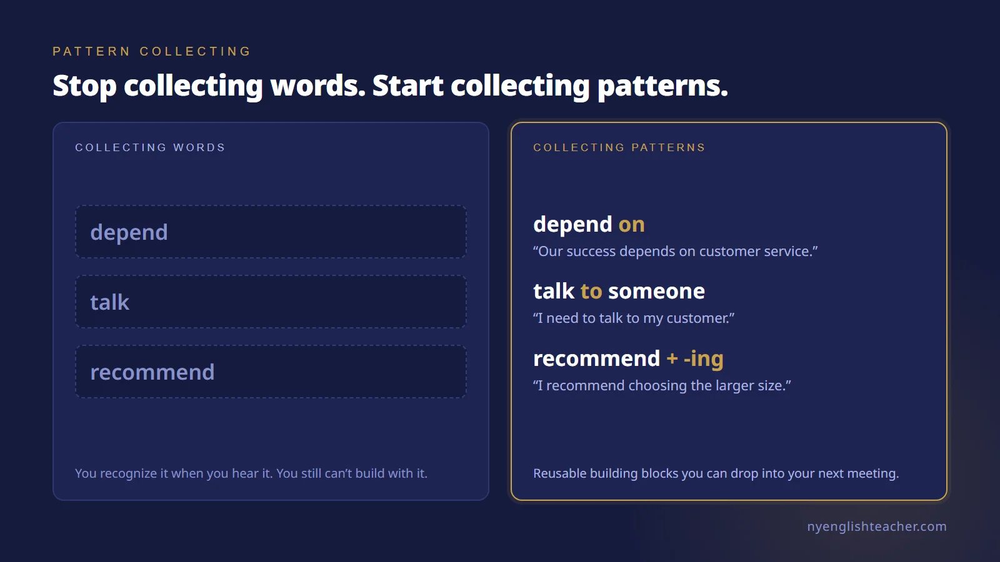
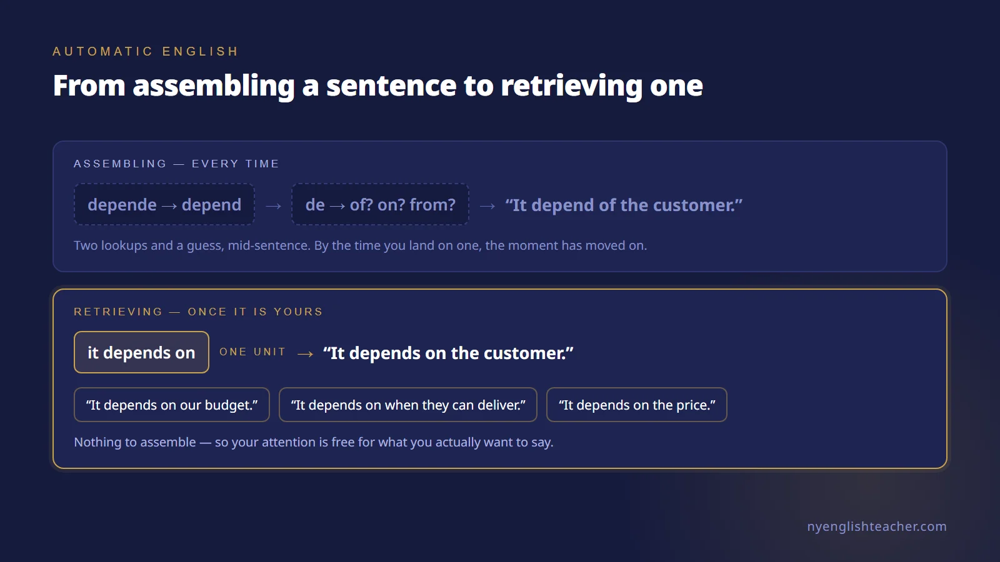
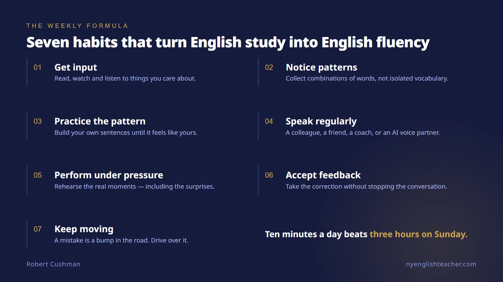

One of the questions I hear most frequently from my English students is:

**"What should I do to improve my English?"**

Should I read more?
Should I watch Netflix in English?
Should I listen to podcasts?
Should I use Duolingo?

My answer is usually: **Yes. Do all of those things if you enjoy them. But if your goal is to speak English confidently, you also have to speak English.**

That sounds obvious, but it is one of the most important distinctions I can make as an English coach.

You can read English for twenty minutes every day. You can watch videos in English. You can complete your Duolingo exercises. You can memorize vocabulary.

All of those activities can help.

But speaking is a skill, and skills have to be practiced.

You would never expect to become a good tennis player simply by watching tennis videos. You would never expect to become an excellent presenter by reading books about presentations but never standing in front of another person and presenting.

English works the same way.

## Make English part of your week

I generally recommend that my students do something with English almost every day.

It does not have to be an hour.

Ten minutes matters. Fifteen minutes matters. Twenty minutes matters.

Take the weekend off if you want. But during the working week, try to keep English present in your life.

More importantly, don't make all of that practice passive.

Reading and listening provide valuable input. Speaking forces you to retrieve English, organize your thoughts, choose vocabulary, use grammar, pronounce the words, listen to another person, understand their response, and formulate your next idea — all in real time.

That is where a different kind of learning begins.

## Find someone and talk

If possible, find someone with whom you can regularly speak English.

It could be a friend, colleague, coworker, business associate, or family member.

Their English does not have to be perfect. Ideally, they are approximately at your level or somewhat above it.

And if both of you are Mexican, Colombian, Brazilian, Japanese, French, or anything else, don't feel embarrassed speaking English to one another.

Speak normally.
Speak confidently.
Be yourself.

You are not pretending to be American or British. You are practicing another language that you want to use professionally and socially.

If you don't have another person available, technology has given us another useful option: talk to an AI assistant with voice capabilities.

Have a real conversation with it.

Explain what happened at work today. Practice an upcoming presentation. Role-play a sales conversation. Discuss a difficult client. Describe a product. Ask it to challenge your opinions. Ask follow-up questions.

But actually **speak**.

Don't only type.

## Make correction helpful, not painful

When you practice with another person, create a simple agreement.

You are there to help one another improve.

If your partner hears something that can be expressed much more naturally, they can help you.

And if they make a mistake that you confidently know how to improve, you can help them.

The important word is **help**.

Correction should not become criticism.

And you do not need to interrupt every sentence because someone used the wrong preposition or pronounced one word imperfectly. If you correct everything, the conversation stops being a conversation.

Pay particular attention to mistakes that cause confusion, mistakes that happen repeatedly, and opportunities where a small change would noticeably improve the person's English.

When somebody corrects you, don't become defensive.

Say, "Ah, okay. Thank you."

Try the improved version once.

Then keep going.

A mistake is a bump in the road. Drive over the bump and continue the journey.

Some students make a mistake and mentally stop the entire conversation. They begin analyzing what they said. They become nervous. Their confidence disappears.

Don't do that to yourself.

Acknowledge the mistake, learn from it, and keep communicating.

Fluency requires forward movement.

## Stop collecting words. Start collecting patterns.

There is another technique I strongly recommend, and I believe it can dramatically change the way a student learns English.

**Look for patterns.**

Most students are taught to collect individual vocabulary words.

I prefer to teach students to collect useful pieces of language.

Let's take the verb **depend**.

Knowing the word *depend* is useful.

But knowing the pattern **depend on** is much more useful.

"We depend on our suppliers."
"Our success depends on customer service."
"It depends on the price."

Now you have something you can actually use.

Consider the verb **talk**.

You might hear:

"I talked to Robert yesterday."

Don't only notice the word *talked*. Notice the pattern:

**talk to someone**

Then make it yours.

"I need to talk to my customer."
"I talked to the sales team."
"Can I talk to you tomorrow?"

Now you are building reusable English.

Or consider **recommend**, an extremely useful verb for someone working in sales.

"I recommend this stone because it offers excellent value."
"I recommend choosing the larger size."
"I'd recommend this option for a customer who wants something elegant."

Those are not isolated words anymore. They are building blocks.

I often encourage students to find only a couple of valuable patterns each week.

Not twenty.
Not fifty.
Two.

Notice them. Write them down. Say them aloud. Create different sentences with them. Use them in your next conversation.

The objective is ownership.

> This is exactly what the free [Verb Pattern Mastery course](/en/course/verb-patterns/) drills — the prepositions that follow verbs, gerund vs. infinitive, and the patterns that Spanish quietly rewrites for you. Ten lessons, audio on every example, no sign-up.

## From translation to automatic English

Beginning and intermediate students frequently construct a sentence in Spanish first and then translate it into English.

That is completely normal.

But as your English improves, you want to reduce that process.

This is another reason patterns are so powerful.

Imagine that every time you want to say *depende de*, you have to translate both words individually.

That takes mental effort.

But after you have heard and used **"it depends on…"** hundreds of times, it begins to function as one unit.

You don't assemble it anymore.

You retrieve it.

"It depends on the customer."
"It depends on our budget."
"It depends on when they can deliver it."

The language becomes increasingly automatic.

The more useful patterns you own, the less construction you have to perform while you are speaking.

That gives your brain more capacity to think about something much more important:

**What do I actually want to say?**

That is when English starts becoming conversational.

It is also the reason [meetings feel so much harder than one-on-one conversations](/en/blog/why-you-struggle-speaking-english-in-meetings/). A meeting doesn't slow down while you assemble.

## Use content you actually care about

Students sometimes ask me what they should read or watch in English.

My answer is: start with something you genuinely care about.

If you run a jewelry company, watch videos about jewelry, luxury marketing, sales, operations, leadership, or customer experience.

If you're an architect, consume content about architecture.

If you love football, listen to football podcasts.

If you're fascinated by technology, follow technology channels.

Don't make English practice unnecessarily boring.

Interest gives you a reason to continue.

But there is one important difference between simply consuming content and actively learning from it.

Don't only ask:

**"What does this mean?"**

Also ask:

**"How did they say that?"**

Listen for the phrases.

Notice the verbs.

Notice the prepositions that follow those verbs.

Notice how someone introduces an opinion, disagrees politely, recommends something, explains a problem, compares two alternatives, or persuades another person.

Steal the patterns — and then make them your own.

## Where does Duolingo fit?

I like Duolingo.

It is convenient. It is enjoyable. It encourages consistency. Spending five, ten, or fifteen minutes a day using an app like Duolingo can absolutely have a place in someone's English routine.

But an app should be part of the system, not the entire system.

If your objective is conversation, eventually another person has to say something you weren't expecting, and you have to respond.

There is no pause button.

That unpredictability is part of real communication.

It is also why I believe regular lessons with a good teacher or coach can be valuable. A lesson gives you dedicated time to speak, receive targeted feedback, discover better ways to express yourself, and practice language connected to the situations you actually encounter.

For my business students, that may mean leadership, presentations, negotiations, marketing, sales, meetings, or difficult conversations with employees and customers.

We are not studying English simply to pass an English test.

We are developing the English they need to perform.

## Practice under real conditions

There is one more layer, and in my coaching it may be the most important one.

Real communication rarely happens under ideal conditions.

A client pushes back on your price. A colleague asks a question you didn't prepare for. Your presentation is going well — and then an executive interrupts with a challenge. Even a carefully planned speech becomes impromptu the moment the room responds.

This is true in the corporate world. It is true when you run your own business. It is true in a job interview.

So don't only practice comfortable English. Practice the situations of your real professional life.

If you work in sales, practice persuading. If you are a rising leader, practice presenting, leading a meeting, and having a difficult conversation with an employee. If you have an interview coming, practice answering the question you hope nobody asks.

And invite a little surprise into your practice. Ask your conversation partner — or your coach, or your AI voice assistant — to interrupt you, challenge you, and change direction without warning.

The stress is deliberate, and it is kind.

When you have performed under a little pressure in practice, real pressure feels familiar.

## A simple formula

If someone asked me to create a simple weekly formula for improving spoken English, it would be this:

* **Get input:** read, listen, watch, and learn about subjects that interest you.
* **Notice patterns:** pay attention to useful combinations of words rather than collecting vocabulary in isolation.
* **Practice those patterns:** create your own examples until they begin to feel natural.
* **Speak regularly:** practice with a friend, colleague, family member, teacher, coach, or AI voice partner.
* **Perform under pressure:** rehearse the real situations of your work — including the surprises.
* **Accept feedback:** appreciate useful corrections without allowing them to destroy the flow of the conversation.
* **Keep moving:** when you make a mistake, learn something from it and continue speaking.

And above all, be patient with yourself.

You do not become fluent because one day you finally stop making mistakes.

You become fluent because you keep communicating even while you are still making them.

Every conversation gives you another repetition.

Every useful pattern becomes another tool.

Every correction teaches you something.

And little by little, English stops feeling like something you are translating and starts feeling like something you simply **speak**.

That is the goal.

Not perfect English.

**Confident, competent, natural communication.**

*Fluency isn't a talent. It's deliberate practice.*

## Start this week

Pick one thing from the formula. Not all seven — one.

If you want the fastest starting point, make it the patterns. Choose two this week, write them down, build five sentences with each, and use them out loud in a real conversation before Friday.

Then keep going from there:

* Work through the free [Verb Pattern Mastery course](/en/course/verb-patterns/) — ten lessons, audio on every example, nothing to sign up for. It's the pattern-collecting habit turned into a structured drill.
* Browse [all the free courses](/en/courses/) if you'd rather start from your level than from a topic.
* If the pressure moments are what worry you — the board update, the investor call, the negotiation, the interview — that's what I coach. [Book a free intro session](/en/book/) and bring the meeting that's actually on your calendar. We'll work that, not a textbook chapter.

## Frequently asked questions

**What is the fastest way to improve my spoken English?**
Speak more often, in shorter sessions, about things you actually have to talk about at work. Reading, listening and apps give you input, and input matters — but speaking is the only activity that forces you to retrieve English, organize a thought, choose the words, pronounce them, and process someone's response in real time. Ten or fifteen minutes of that during the working week beats one long study session on the weekend.

**Is it bad to practice English with another non-native speaker?**
No. It's one of the most practical things you can do. Your partner's English does not have to be perfect — ideally they're at roughly your level or a little above it. Two Mexican colleagues speaking English to each other are not pretending to be American; they're practicing a language they both use professionally. Agree in advance that you'll help each other with the mistakes that cause confusion or repeat often, and let the small ones go.

**Should I use Duolingo to improve my English?**
Duolingo is fine and I have no problem with it. It's convenient, it encourages consistency, and five to fifteen minutes a day has a real place in a routine. Just don't let the app be the entire system. If your goal is conversation, at some point another person has to say something you weren't expecting and you have to respond. There is no pause button in a real meeting.

**Why do I still translate from Spanish in my head when I speak English?**
Because you're assembling sentences word by word instead of retrieving them whole. Every time you build "depende de" from two separate translations, you spend mental effort mid-sentence. Once you've heard and used "it depends on" enough times, it stops being two decisions and becomes one unit you simply pull out. Collecting patterns rather than isolated vocabulary is what makes that shift happen faster.

**How much English practice per week is enough?**
Something almost every working day, even if it's short. Ten minutes matters. Fifteen minutes matters. Take the weekend off if you want to. Consistency beats duration, because the goal isn't to accumulate study hours — it's to keep English present and active enough that retrieval gets faster.
