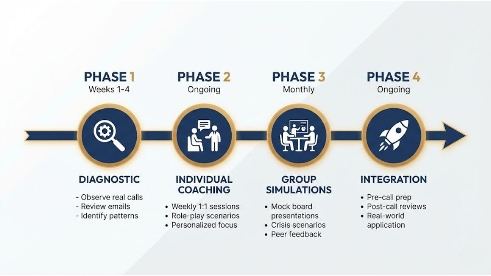
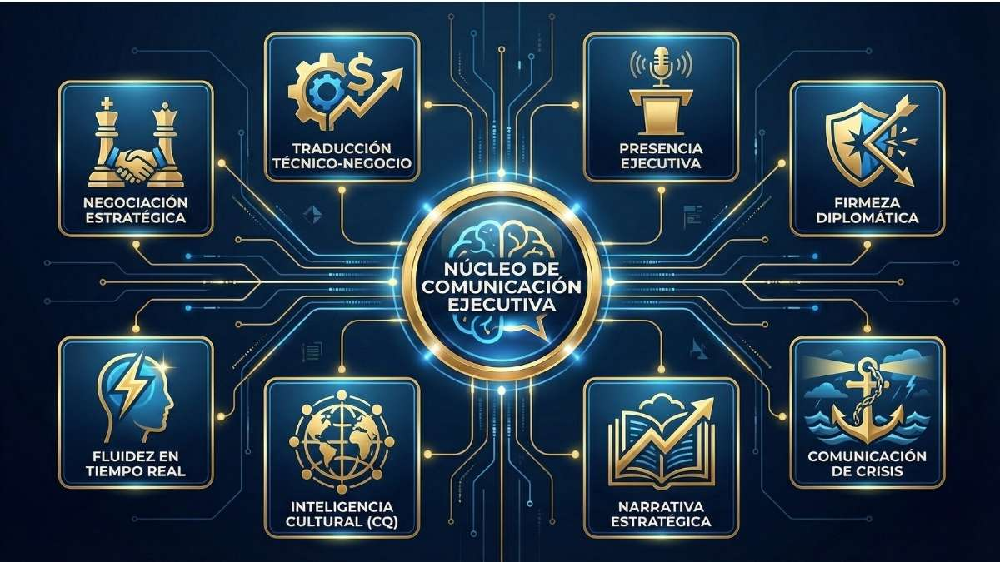

Cuando la Directora de Operaciones de una empresa líder mexicana de venta directa me contactó sobre coaching de inglés, no preguntó sobre ejercicios de gramática ni listas de vocabulario.

Preguntó: "¿Puede ayudar a mi equipo directivo a dominar una sala cuando la sala está llena de estadounidenses?"

Doce meses después, esa pregunta había sido respondida—pero la transformación fue mucho más profunda de lo que nadie esperaba.

## La Empresa: Una Historia de Éxito Mexicana Expandiéndose al Norte

Esta empresa de cosméticos y belleza, fundada en 2008, había crecido a más de 500 empleados con centros de distribución en todo México. Su misión se centraba en empoderar a las mujeres a través del emprendimiento—un modelo que había creado miles de consultoras independientes y construido una marca de confianza para las familias mexicanas.

Pero el crecimiento había creado un nuevo desafío.

Su expansión al mercado estadounidense requería que los ejecutivos lideraran llamadas con socios americanos, negociaran contratos con proveedores en inglés y presentaran ante miembros del consejo de habla inglesa. El equipo directivo tenía la perspicacia empresarial. Tenían la experiencia en la industria. Lo que les faltaba era la confianza para desplegar esa experiencia en su segundo idioma.

## El Equipo Directivo: Seis Ejecutivos, Seis Desafíos Diferentes

Durante 12 meses, trabajé con seis líderes senior de la organización:

**La Directora de Operaciones en México** — Brillante en operaciones, pero evitaba las llamadas en inglés siempre que era posible. Delegaba a colegas o reprogramaba reuniones en lugar de liderarlas ella misma.

**La Directora de Operaciones en Estados Unidos** — Hablante nativa de inglés gestionando operaciones transfronterizas. Necesitaba que sus contrapartes mexicanas se comunicaran directamente con los equipos de EE.UU. en lugar de canalizar todo a través de ella.

**El Director General** — Reporta directamente al consejo. Las presentaciones de alto riesgo en inglés se sentían como caminar en la cuerda floja sin red de seguridad.

**El Director Comercial** — Responsable de ventas y marketing en ambos países. Podía discutir estrategia en español durante horas, pero cambiaba a monosílabos en reuniones con clientes en inglés.

**La Directora de Recursos Humanos** — Reclutando gerentes senior en ambas regiones. Las entrevistas telefónicas en inglés eran consistentemente más cortas y menos sustanciales que sus equivalentes en español.

**La Directora de Finanzas/Consejera General** — Una abogada manejando auditorías fiscales, negociaciones con proveedores y liderazgo financiero. Lo que estaba en juego en sus conversaciones en inglés no solo era importante—era legalmente vinculante.

Cada ejecutivo enfrentaba una versión diferente del mismo problema: su inglés era funcional, pero no era _imponente_. En momentos de alta presión, sentían que su autoridad disminuía en el momento en que cambiaban de idioma.

## El Enfoque: Más Allá de la Capacitación en Idiomas

Los programas corporativos tradicionales de inglés siguen un patrón predecible: evaluar el nivel actual, asignar material de estudio, hacer seguimiento de la mejora gramatical, repetir. Los resultados son igualmente predecibles—mejoras modestas que se estancan rápidamente.

Tomamos un enfoque diferente.

### Fase 1: Diagnóstico (Semanas 1-4)

Antes de comenzar cualquier coaching, necesitaba entender no solo su nivel de inglés, sino sus desafíos reales de comunicación. Esto significó:

- Observar llamadas reales con clientes y reuniones internas
- Revisar hilos de correo electrónico y presentaciones
- Entender las situaciones específicas donde la confianza colapsaba
- Identificar patrones en todo el equipo directivo

Lo que surgió fue sorprendente. La gramática no era el problema principal. Las verdaderas barreras eran:

1. **Miedo al juicio en tiempo real** — Ejecutivos que podían escribir correos sofisticados en inglés se paralizaban cuando se les pedía hablar espontáneamente
2. **Brechas en el cambio de código cultural** — Entendían el inglés americano, pero no las normas de comunicación empresarial estadounidense
3. **Falta de marcos de referencia** — Les faltaban enfoques estructurados para manejar objeciones, negociación y presencia ejecutiva
4. **Aislamiento** — Cada líder pensaba que era el único que estaba luchando

### Fase 2: Coaching Individual (Continuo)

Cada ejecutivo recibió sesiones semanales uno a uno adaptadas a sus desafíos específicos:

**Para la Directora de Operaciones en México**, nos enfocamos en [hablar improvisadamente](/es/blog/4-secretos-que-usan-los-ejecutivos/). Necesitaba responder con confianza cuando ejecutivos americanos hacían preguntas inesperadas. Practicamos preguntas y respuestas rápidas hasta que su cerebro dejó de traducir y comenzó a _pensar_ en inglés.

**Para el Director General**, ensayamos presentaciones al consejo repetidamente. No leyendo guiones—_interpretándolos_. Trabajamos en el ritmo, el énfasis y las señales de lenguaje corporal que proyectan autoridad independientemente del acento.

**Para el Director Comercial**, simulamos escenarios con clientes usando marcos como el [marco de negociación de 5 pasos](/es/blog/como-negociar-en-ingles-marco/). Objeciones de precio, negociaciones de alcance, posicionamiento competitivo. Para el quinto mes, podía defender un margen en inglés tan naturalmente como en español.

**Para la Directora de Recursos Humanos**, desarrollamos marcos para entrevistas. No solo preguntas para hacer, sino cómo profundizar, cómo generar conexión y cómo evaluar candidatos cuando ambas partes estaban trabajando en su segundo idioma.

**Para la Directora de Finanzas**, abordamos negociaciones de alto riesgo. Contratos con proveedores, respuestas a auditorías, presentaciones financieras. Practicamos el lenguaje específico de la autoridad legal y financiera—frases que no admiten ambigüedad.

### Fase 3: Simulaciones Grupales (Mensuales)

El coaching individual aborda las brechas personales. Pero los ejecutivos no operan en aislamiento.

Una vez al mes, reunimos al equipo directivo para simulaciones grupales. Estas sesiones recreaban la presión exacta de situaciones empresariales reales:

- **Presentaciones simuladas al consejo** con el equipo interpretando a miembros escépticos del consejo
- **Negociaciones interfuncionales** donde los miembros del equipo tomaban lados opuestos
- **Escenarios de comunicación de crisis** que requerían colaboración en tiempo real
- **Simulaciones de llamadas con clientes** con objeciones y desafíos inesperados

El formato era deliberadamente incómodo. Múltiples observadores. Presión de tiempo. Preguntas desafiantes. El objetivo no era tener éxito—era practicar recuperarse del fracaso en un entorno seguro.

Lo que sucedió en estas sesiones fue inesperado: el equipo comenzó a entrenarse mutuamente. El Director Comercial notó patrones en las presentaciones de la Directora de Operaciones que yo había pasado por alto. La Directora de Finanzas ofreció tácticas de negociación que elevaron el enfoque de todos. El aprendizaje se volvió colaborativo.

### Fase 4: Integración (Continua)

La fase final se enfocó en aplicar las habilidades a situaciones reales. Esto significó:

- **Preparación previa a llamadas** — Sesiones breves antes de reuniones importantes para ensayar puntos clave
- **Revisiones posteriores a llamadas** — ¿Qué funcionó? ¿Qué no? ¿Qué harías diferente?
- **Refinamiento continuo** — Ajustando técnicas basadas en retroalimentación del mundo real

## Más Allá del Inglés: El Currículo Inesperado

Lo que sorprendió tanto a mí como al cliente fue cuánto de nuestro trabajo se extendió más allá del inglés.

Cuando ayudas a alguien a comunicarse más efectivamente en su segundo idioma, inevitablemente abordas _cómo se comunica_, en general. Los marcos que desarrollamos aplicaban igualmente en español:

**Presencia Ejecutiva** — El lenguaje corporal, los patrones vocales y las pausas estratégicas que proyectan autoridad no son específicos del idioma. Varios participantes reportaron que sus presentaciones en español mejoraron como resultado directo de nuestro trabajo en inglés.

**Manejo de Objeciones** — Los marcos para reconocer resistencia, reformular preocupaciones y guiar conversaciones hacia el acuerdo funcionan en cualquier idioma. La Directora de Finanzas usó la misma estructura de negociación que desarrollamos para proveedores estadounidenses en una importante negociación de contrato mexicano.

**Storytelling** — La comunicación empresarial depende de la narrativa. Trabajamos en estructurar información para impacto, usar ejemplos concretos y crear hilos conductores memorables. Estas habilidades se transfirieron inmediatamente a la comunicación interna en español.

**Inteligencia Emocional** — Leer una sala, ajustar tu enfoque en tiempo real y recuperarte de errores son competencias universales de liderazgo. Practicarlas en un segundo idioma—donde todo requiere más esfuerzo consciente—aceleró el desarrollo.

**Hablar en Público** — Varios participantes tenían ansiedad de hablar en público que precedía cualquier desafío con el inglés. Trabajar en inglés nos dio permiso para abordarlo directamente sin activar la defensividad sobre su comunicación en español.

## Los Resultados: Qué Cambió

Después de 12 meses de trabajo intensivo, la transformación fue medible:

**Cambios de Comportamiento:**

- La Directora de Operaciones en México ahora lidera llamadas en inglés sin dudarlo. Reportó que una presentación reciente al consejo en inglés se sintió "casi normal"—una frase que habría sido inimaginable doce meses antes.

- El Director General se ofreció como voluntario para presentar en una conferencia internacional de la industria—algo que había evitado previamente durante años.

- El Director Comercial cerró el acuerdo de asociación más grande de la empresa en Estados Unidos, liderando negociaciones que anteriormente habrían sido manejadas por la Directora de Operaciones en EE.UU.

- Las entrevistas en inglés de la Directora de Recursos Humanos ahora tienen la misma duración que las de español. Reportó identificar candidatos que anteriormente habría descartado debido a barreras del idioma de su lado.

- La Directora de Finanzas lideró exitosamente una discusión de auditoría fiscal con autoridades estadounidenses, una situación que anteriormente había requerido asesoría externa para soporte de comunicación.

**Impacto Organizacional:**

- La comunicación transfronteriza ya no se canaliza a través de un solo ejecutivo bilingüe. El cuello de botella está eliminado.

- La Directora de Operaciones en EE.UU. puede enfocarse en prioridades estratégicas en lugar de servir como capa de traducción para cada conversación importante.

- La eficiencia de las reuniones mejoró. Cuando los ejecutivos pueden expresar matices directamente, las decisiones suceden más rápido.

- La mentoría interna sobre comunicación en inglés se ha vuelto orgánica. Los líderes senior ahora entrenan a gerentes junior en las mismas técnicas.

**Métricas de Confianza:**

Le pedí a cada participante que calificara su confianza en comunicación empresarial en inglés en una escala del 1 al 10 al inicio y al final del programa:

| Ejecutivo                         | Antes | Después | Cambio |
| --------------------------------- | ----- | ------- | ------ |
| Directora de Operaciones (México) | 4     | 8       | +4     |
| Director General                  | 5     | 8       | +3     |
| Director Comercial                | 4     | 7       | +3     |
| Directora de RH                   | 5     | 8       | +3     |
| Directora de Finanzas             | 5     | 8       | +3     |

Las métricas autorreportadas siempre deben verse con el escepticismo apropiado. Pero la evidencia conductual respalda estos números. Estos ejecutivos están haciendo cosas que no habrían intentado hace un año.

## Qué Hizo que Esto Funcionara: Factores Clave de Éxito

Reflexionando sobre este proyecto, varios factores habilitaron los resultados:

**1. Compromiso Ejecutivo**

La Directora de Operaciones que inició este programa participó completamente. Cuando el líder principal visiblemente se compromete con la mejora—incluyendo ser vulnerable sobre sus propias brechas—crea permiso para todos los demás.

**2. Duración Sostenida**

Doce meses permitieron un cambio real de comportamiento. Los programas a corto plazo podrían mejorar puntuaciones de exámenes, pero rara vez cambian patrones de comunicación profundamente arraigados. El cronograma extendido significó que pudimos iterar, ajustar y reforzar hasta que los nuevos comportamientos se volvieran automáticos.

**3. Situaciones Reales Sobre Simulaciones**

Trabajamos con presentaciones reales de clientes, escenarios de negociación reales y presentaciones próximas. El contenido era inmediatamente aplicable, lo que aumentó tanto el compromiso como la retención.

**4. Aprendizaje Entre Pares**

Las sesiones grupales crearon responsabilidad y aceleraron el aprendizaje. Los participantes aprendieron de ver a otros tener éxito y fracasar. El apoyo emocional de la lucha compartida hizo que los desafíos individuales se sintieran menos aislantes.

**5. Enfoque Más Allá del Idioma**

Al enmarcar esto como desarrollo de comunicación ejecutiva en lugar de "clases de inglés", evitamos el estigma que a veces se asocia con el aprendizaje de idiomas. Los participantes estaban desarrollando capacidades de liderazgo, no remediando deficiencias.

## Lecciones para Otras Organizaciones

Si tu organización está considerando un desarrollo similar para equipos directivos, considera:

**Evalúa el problema real.** Las pruebas de competencia en inglés miden gramática y vocabulario. No miden si alguien puede dominar una sala, defender un precio o recuperarse de una objeción inesperada. Entiende qué situaciones realmente desafían a tu equipo.

**Piensa en sistemas.** El coaching individual es necesario pero insuficiente. Los líderes operan en sistemas—dinámicas de equipo, relaciones de reporte, cultura organizacional. El trabajo grupal crea cambios que el coaching individual solo no puede.

**Presupuesta para duración.** La transformación real requiere tiempo. Ocho semanas podrían mejorar la confianza temporalmente. Doce meses pueden cambiar carreras.

**Aborda el kit completo de herramientas ejecutivas.** Las habilidades de idioma importan, pero son insuficientes sin los marcos de comunicación subyacentes. El mejor inglés del mundo no ayudará a un ejecutivo que no sabe cómo manejar una objeción o estructurar un argumento persuasivo.

**Empieza desde arriba.** Cuando los líderes senior participan visiblemente, crean permiso para todos los demás. Cuando se esconden en coaching privado mientras envían al personal junior a clases grupales, señalan que luchar con el inglés es vergonzoso. Lo primero acelera el desarrollo; lo segundo lo inhibe.

## Qué Sigue para Este Equipo

El programa ha evolucionado hacia soporte continuo. Las sesiones mensuales mantienen el impulso y abordan nuevos desafíos a medida que surgen. La expansión a Estados Unidos continúa, requiriendo comunicación transfronteriza cada vez más sofisticada. La base ahora está en su lugar.

Pero quizás el resultado más significativo es más difícil de medir: estos ejecutivos ahora ven la comunicación en inglés como una habilidad a desarrollar continuamente en lugar de una limitación fija que hay que sortear. Ese cambio de mentalidad puede resultar más valioso que cualquier técnica específica que practicamos.

## ¿Está Listo Tu Equipo Directivo?

Cada organización que se expande a través de fronteras lingüísticas enfrenta una versión de este desafío. La pregunta no es si el inglés de tus ejecutivos es lo suficientemente bueno—es si pueden desplegar toda su experiencia, autoridad y presencia al hablar su segundo idioma.

Si la respuesta no es un "sí" incondicional, la brecha te está costando dinero. En negociaciones donde tu equipo no puede defender el valor. En relaciones con clientes que nunca profundizan más allá de lo transaccional. En oportunidades que nunca se persiguen porque las personas correctas no se sienten listas.

La buena noticia: estas brechas se pueden cerrar. No con ejercicios de gramática o listas de vocabulario, sino con desarrollo sostenido y estratégico enfocado en situaciones empresariales reales.

---

_Robert Cushman es un coach de inglés empresarial especializado en comunicación de alto riesgo para empresas latinoamericanas de tecnología y servicios profesionales. Su Evaluación de Confianza en Comunicación ayuda a las organizaciones a identificar exactamente dónde las brechas de idioma les están costando negocios. [Conoce más sobre el enfoque de Robert →](/es/about/)_

## Sigue Leyendo

- [Manual de comunicación ejecutiva: 7 pilares clave](/es/blog/manual-comunicacion-ejecutiva/) — Los marcos completos que usamos con equipos directivos como el de este caso.
- [Presencia ejecutiva en videollamadas: 7 hábitos clave](/es/blog/presencia-ejecutiva-en-videollamadas/) — Las técnicas de presencia en cámara que transformaron las reuniones virtuales de este equipo.
- [Cómo negociar en inglés: marco probado de 5 pasos](/es/blog/como-negociar-en-ingles-marco/) — El marco de negociación que usó el Director Comercial para cerrar el acuerdo más grande de la empresa.

---

**[Toma el quiz gratuito de Confianza en Comunicación Ejecutiva →](/es/quiz/executives/)**

**[Reserva una llamada de estrategia gratuita para discutir tu equipo →](/es/reservar/)**
