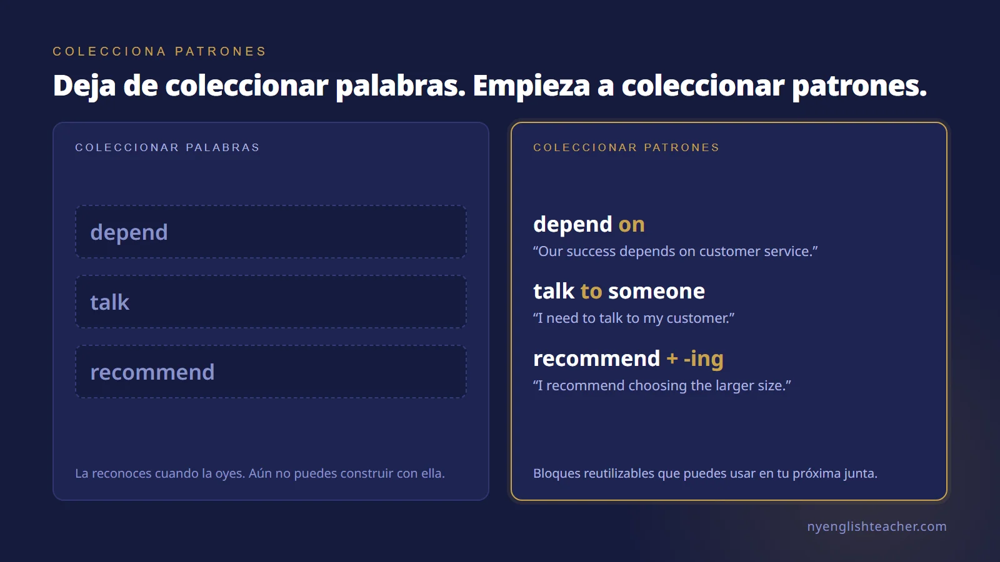
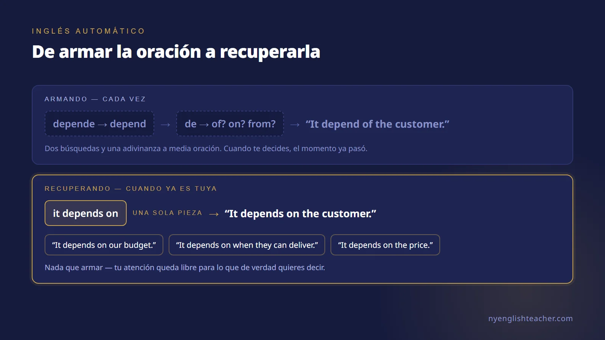
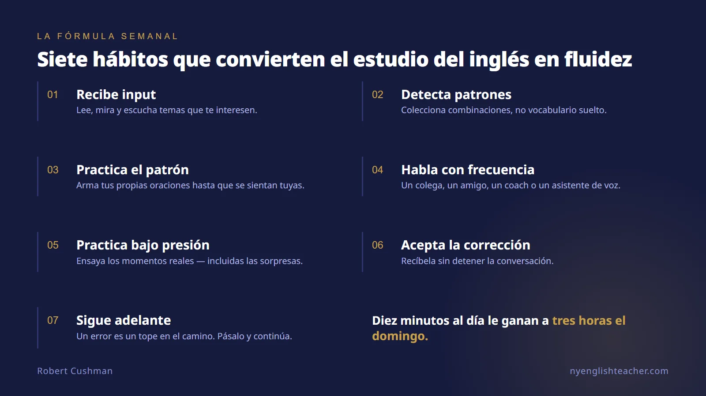

Una de las preguntas que más escucho de mis estudiantes de inglés es:

**"¿Qué debo hacer para mejorar mi inglés?"**

¿Debo leer más?
¿Debo ver Netflix en inglés?
¿Debo escuchar podcasts?
¿Debo usar Duolingo?

Mi respuesta normalmente es: **Sí. Haz todas esas cosas si las disfrutas. Pero si tu objetivo es hablar inglés con confianza, también tienes que hablar inglés.**

Suena obvio, pero es una de las distinciones más importantes que puedo hacer como coach de inglés.

Puedes leer en inglés veinte minutos todos los días. Puedes ver videos en inglés. Puedes completar tus ejercicios de Duolingo. Puedes memorizar vocabulario.

Todas esas actividades pueden ayudar.

Pero hablar es una habilidad, y las habilidades se practican.

Nunca esperarías volverte buen tenista con solo ver videos de tenis. Nunca esperarías volverte un excelente presentador leyendo libros sobre presentaciones sin nunca pararte frente a otra persona a presentar.

El inglés funciona igual.

## Haz que el inglés sea parte de tu semana

Por lo general les recomiendo a mis estudiantes que hagan algo con el inglés casi todos los días.

No tiene que ser una hora.

Diez minutos cuentan. Quince minutos cuentan. Veinte minutos cuentan.

Tómate el fin de semana si quieres. Pero entre semana, procura mantener el inglés presente en tu vida.

Y más importante: no hagas que toda esa práctica sea pasiva.

Leer y escuchar te dan input valioso. Hablar te obliga a recuperar el inglés, organizar tus ideas, elegir vocabulario, usar la gramática, pronunciar las palabras, escuchar a otra persona, entender su respuesta y formular tu siguiente idea — todo en tiempo real.

Ahí es donde empieza otro tipo de aprendizaje.

## Encuentra a alguien y habla

Si es posible, busca a alguien con quien puedas hablar inglés de manera regular.

Puede ser un amigo, un colega, un compañero de trabajo, un socio o un familiar.

Su inglés no tiene que ser perfecto. De preferencia, está más o menos en tu nivel o un poco arriba.

Y si los dos son mexicanos, colombianos, brasileños, japoneses, franceses o lo que sea, no se sientan raros hablando inglés entre ustedes.

Habla normal.
Habla con seguridad.
Sé tú mismo.

No estás fingiendo ser estadounidense ni británico. Estás practicando otro idioma que quieres usar profesional y socialmente.

Si no tienes a otra persona disponible, la tecnología nos dio otra opción útil: habla con un asistente de inteligencia artificial que tenga voz.

Ten una conversación de verdad con él.

Explícale qué pasó hoy en el trabajo. Practica una presentación que se viene. Haz un role-play de una conversación de ventas. Habla de un cliente difícil. Describe un producto. Pídele que cuestione tus opiniones. Haz preguntas de seguimiento.

Pero de verdad **habla**.

No solo escribas.

## Haz que la corrección ayude, no que duela

Cuando practiques con otra persona, hagan un acuerdo sencillo.

Están ahí para ayudarse a mejorar.

Si tu compañero escucha algo que se puede decir de forma mucho más natural, te puede ayudar.

Y si él comete un error que tú sabes con seguridad cómo mejorar, tú le puedes ayudar.

La palabra importante es **ayudar**.

La corrección no debe convertirse en crítica.

Y no necesitas interrumpir cada oración porque alguien usó la preposición equivocada o pronunció una palabra de manera imperfecta. Si corriges todo, la conversación deja de ser una conversación.

Pon atención especial a los errores que causan confusión, a los errores que se repiten, y a las oportunidades donde un cambio pequeño mejoraría notablemente el inglés de la persona.

Cuando alguien te corrija, no te pongas a la defensiva.

Di: "Ah, okay. Gracias."

Prueba la versión mejorada una vez.

Y sigue adelante.

Un error es un tope en el camino. Pásalo y continúa el viaje.

Algunos estudiantes cometen un error y mentalmente detienen toda la conversación. Empiezan a analizar lo que dijeron. Se ponen nerviosos. Su confianza desaparece.

No te hagas eso.

Reconoce el error, aprende de él y sigue comunicando.

La fluidez requiere movimiento hacia adelante.

## Deja de coleccionar palabras. Empieza a coleccionar patrones.

Hay otra técnica que recomiendo mucho, y creo que puede cambiar drásticamente la forma en que un estudiante aprende inglés.

**Busca patrones.**

A la mayoría de los estudiantes les enseñan a coleccionar palabras de vocabulario individuales.

Yo prefiero enseñarles a coleccionar piezas de lenguaje útiles.

Tomemos el verbo **depend**.

Saber la palabra *depend* es útil.

Pero saber el patrón **depend on** es mucho más útil.

"We depend on our suppliers."
"Our success depends on customer service."
"It depends on the price."

Ahora sí tienes algo que puedes usar.

Considera el verbo **talk**.

Puede que escuches:

"I talked to Robert yesterday."

No te quedes solo con la palabra *talked*. Fíjate en el patrón:

**talk to someone**

Y después hazlo tuyo.

"I need to talk to my customer."
"I talked to the sales team."
"Can I talk to you tomorrow?"

Ahora estás construyendo inglés reutilizable.

O considera **recommend**, un verbo extremadamente útil para alguien que trabaja en ventas.

"I recommend this stone because it offers excellent value."
"I recommend choosing the larger size."
"I'd recommend this option for a customer who wants something elegant."

Esas ya no son palabras aisladas. Son bloques de construcción.

Con frecuencia animo a mis estudiantes a encontrar solo un par de patrones valiosos cada semana.

No veinte.
No cincuenta.
Dos.

Detéctalos. Anótalos. Dilos en voz alta. Crea distintas oraciones con ellos. Úsalos en tu siguiente conversación.

El objetivo es que sean tuyos.

> Esto es exactamente lo que ejercita el [curso gratuito de Patrones Verbales](/es/curso/patrones-verbales/) — las preposiciones que siguen a cada verbo, gerundio contra infinitivo, y los patrones que el español te reescribe sin que te des cuenta. Diez lecciones, audio en cada ejemplo, sin registro.

## De traducir a inglés automático

Los estudiantes principiantes e intermedios con frecuencia construyen la oración primero en español y después la traducen al inglés.

Eso es completamente normal.

Pero conforme tu inglés mejora, quieres reducir ese proceso.

Esta es otra razón por la que los patrones son tan poderosos.

Imagina que cada vez que quieres decir *depende de* tienes que traducir las dos palabras por separado.

Eso cuesta esfuerzo mental.

Pero después de haber escuchado y usado **"it depends on…"** cientos de veces, empieza a funcionar como una sola unidad.

Ya no la armas.

La recuperas.

"It depends on the customer."
"It depends on our budget."
"It depends on when they can deliver it."

El idioma se vuelve cada vez más automático.

Entre más patrones útiles tengas tuyos, menos construcción tienes que hacer mientras hablas.

Eso le da a tu cerebro más capacidad para pensar en algo mucho más importante:

**¿Qué es lo que en realidad quiero decir?**

Ahí es cuando el inglés empieza a volverse conversacional.

También es la razón por la que [las juntas se sienten mucho más difíciles que una conversación uno a uno](/es/blog/por-que-te-cuesta-hablar-ingles-en-reuniones/). Una junta no se detiene mientras tú armas la oración.

## Usa contenido que de verdad te interese

A veces mis estudiantes me preguntan qué deberían leer o ver en inglés.

Mi respuesta es: empieza con algo que genuinamente te interese.

Si diriges una empresa de joyería, ve videos sobre joyería, marketing de lujo, ventas, operaciones, liderazgo o experiencia del cliente.

Si eres arquitecto, consume contenido sobre arquitectura.

Si te encanta el futbol, escucha podcasts de futbol.

Si te fascina la tecnología, sigue canales de tecnología.

No hagas que la práctica del inglés sea innecesariamente aburrida.

El interés te da una razón para continuar.

Pero hay una diferencia importante entre solo consumir contenido y aprender activamente de él.

No preguntes únicamente:

**"¿Qué significa esto?"**

Pregunta también:

**"¿Cómo lo dijeron?"**

Escucha las frases.

Fíjate en los verbos.

Fíjate en las preposiciones que siguen a esos verbos.

Fíjate en cómo alguien introduce una opinión, discrepa con cortesía, recomienda algo, explica un problema, compara dos alternativas o persuade a otra persona.

Róbate los patrones — y después hazlos tuyos.

## ¿Dónde entra Duolingo?

Duolingo me gusta.

Es cómodo. Es entretenido. Fomenta la constancia. Dedicar cinco, diez o quince minutos al día a una app como Duolingo puede tener un lugar perfectamente válido en la rutina de alguien.

Pero una app debe ser parte del sistema, no el sistema completo.

Si tu objetivo es conversar, tarde o temprano otra persona va a decir algo que no esperabas y vas a tener que responder.

No hay botón de pausa.

Esa impredecibilidad es parte de la comunicación real.

También es la razón por la que creo que las clases regulares con un buen maestro o coach pueden ser valiosas. Una clase te da tiempo dedicado para hablar, recibir retroalimentación puntual, descubrir mejores formas de expresarte y practicar el lenguaje conectado con las situaciones que de verdad enfrentas.

Para mis estudiantes de negocios, eso puede significar liderazgo, presentaciones, negociaciones, marketing, ventas, juntas o conversaciones difíciles con empleados y clientes.

No estamos estudiando inglés simplemente para pasar un examen de inglés.

Estamos desarrollando el inglés que necesitan para desempeñarse.

## Practica en condiciones reales

Hay una capa más, y en mi coaching quizá sea la más importante.

La comunicación real casi nunca ocurre en condiciones ideales.

Un cliente cuestiona tu precio. Un colega hace una pregunta para la que no te preparaste. Tu presentación va bien — y de pronto un directivo interrumpe con un cuestionamiento. Incluso un discurso cuidadosamente planeado se vuelve improvisado en cuanto la sala responde.

Esto es cierto en el mundo corporativo. Es cierto cuando tienes tu propio negocio. Es cierto en una entrevista de trabajo.

Así que no practiques únicamente el inglés cómodo. Practica las situaciones de tu vida profesional real.

Si trabajas en ventas, practica persuadir. Si eres un líder en ascenso, practica presentar, dirigir una junta y tener una conversación difícil con un empleado. Si tienes una entrevista próxima, practica responder la pregunta que esperas que nadie te haga.

E invita un poco de sorpresa a tu práctica. Pídele a tu compañero de conversación — o a tu coach, o a tu asistente de voz — que te interrumpa, que te cuestione y que cambie de dirección sin avisar.

El estrés es deliberado, y es un acto de generosidad.

Cuando ya te desempeñaste bajo un poco de presión en la práctica, la presión real se siente conocida.

## Una fórmula sencilla

Si alguien me pidiera crear una fórmula semanal sencilla para mejorar el inglés hablado, sería esta:

* **Recibe input:** lee, escucha, mira y aprende sobre temas que te interesen.
* **Detecta patrones:** pon atención a combinaciones útiles de palabras en lugar de coleccionar vocabulario aislado.
* **Practica esos patrones:** crea tus propios ejemplos hasta que empiecen a sentirse naturales.
* **Habla con frecuencia:** practica con un amigo, un colega, un familiar, un maestro, un coach o un asistente de voz.
* **Practica bajo presión:** ensaya las situaciones reales de tu trabajo — incluidas las sorpresas.
* **Acepta la retroalimentación:** agradece las correcciones útiles sin dejar que destruyan el flujo de la conversación.
* **Sigue adelante:** cuando cometas un error, aprende algo de él y continúa hablando.

Y sobre todo, ten paciencia contigo mismo.

No te vuelves fluido porque un día por fin dejas de cometer errores.

Te vuelves fluido porque sigues comunicando incluso mientras todavía los cometes.

Cada conversación te da otra repetición.

Cada patrón útil se convierte en otra herramienta.

Cada corrección te enseña algo.

Y poco a poco, el inglés deja de sentirse como algo que estás traduciendo y empieza a sentirse como algo que simplemente **hablas**.

Ese es el objetivo.

No un inglés perfecto.

**Comunicación segura, competente y natural.**

*La fluidez no es un talento. Es práctica deliberada.*

## Empieza esta semana

Elige una cosa de la fórmula. No las siete — una.

Si quieres el punto de partida más rápido, que sean los patrones. Escoge dos esta semana, anótalos, arma cinco oraciones con cada uno y úsalos en voz alta en una conversación real antes del viernes.

Y de ahí, sigue:

* Toma el [curso gratuito de Patrones Verbales](/es/curso/patrones-verbales/) — diez lecciones, audio en cada ejemplo, sin registro. Es el hábito de coleccionar patrones convertido en ejercicio estructurado.
* Revisa [todos los cursos gratuitos](/es/cursos/) si prefieres empezar por tu nivel en vez de por un tema.
* Y si lo que te preocupa son los momentos de presión — la junta con el consejo, la llamada con inversionistas, la negociación, la entrevista — de eso me encargo yo. [Agenda una sesión de introducción gratuita](/es/reservar/) y trae la junta que de verdad tienes en el calendario. Trabajamos esa, no un capítulo de libro.

## Preguntas frecuentes

**¿Cuál es la forma más rápida de mejorar mi inglés hablado?**
Habla más seguido, en sesiones más cortas, sobre los temas de los que realmente tienes que hablar en el trabajo. Leer, escuchar y las apps te dan input, y el input importa — pero hablar es la única actividad que te obliga a recuperar el inglés, organizar una idea, elegir las palabras, pronunciarlas y procesar la respuesta de otra persona en tiempo real. Diez o quince minutos de eso entre semana le ganan a una sesión larga de estudio el domingo.

**¿Está mal practicar inglés con otra persona que tampoco es nativa?**
No. Es una de las cosas más prácticas que puedes hacer. El inglés de tu compañero no tiene que ser perfecto — de preferencia está más o menos en tu nivel o un poco arriba. Dos colegas mexicanos hablando inglés entre ellos no están fingiendo ser estadounidenses; están practicando un idioma que ambos usan profesionalmente. Acuerden desde el inicio que se van a ayudar con los errores que causan confusión o que se repiten, y dejen pasar los chiquitos.

**¿Debería usar Duolingo para mejorar mi inglés?**
Duolingo está bien y no tengo ningún problema con él. Es cómodo, fomenta la constancia, y de cinco a quince minutos al día tienen un lugar real en una rutina. Nada más no dejes que la app sea todo el sistema. Si tu objetivo es conversar, en algún momento otra persona va a decir algo que no esperabas y vas a tener que responder. En una junta real no hay botón de pausa.

**¿Por qué sigo traduciendo del español en mi cabeza cuando hablo inglés?**
Porque estás armando las oraciones palabra por palabra en lugar de recuperarlas completas. Cada vez que construyes "depende de" a partir de dos traducciones separadas, gastas esfuerzo mental a media oración. Una vez que has escuchado y usado "it depends on" suficientes veces, deja de ser dos decisiones y se vuelve una sola pieza que simplemente sacas. Coleccionar patrones en lugar de vocabulario suelto es lo que acelera ese cambio.

**¿Cuánta práctica de inglés a la semana es suficiente?**
Algo casi todos los días hábiles, aunque sea corto. Diez minutos cuentan. Quince minutos cuentan. Tómate el fin de semana si quieres. La constancia le gana a la duración, porque el objetivo no es acumular horas de estudio — es mantener el inglés presente y activo lo suficiente para que la recuperación sea cada vez más rápida.
