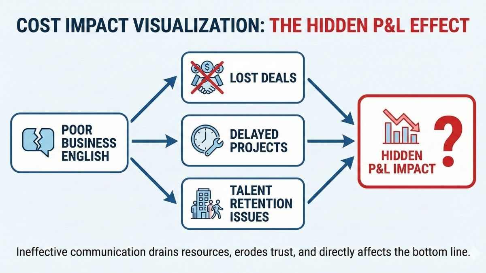
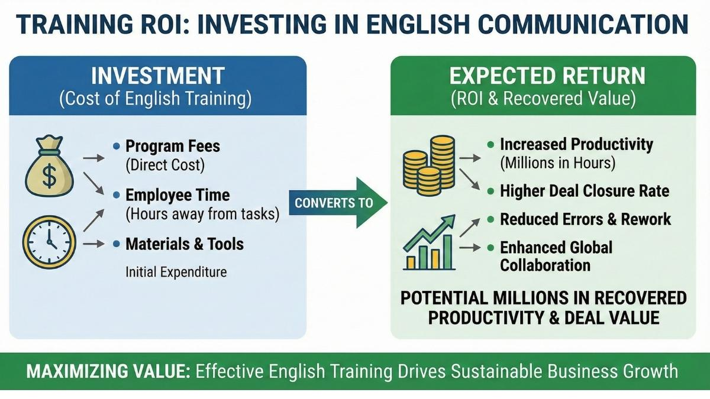

## El Costo del Inglés Débil: Contratos y Carreras Perdidas

**El inglés deficiente no es solo un inconveniente—crea pérdidas de ingresos medibles, retrabajo y techos profesionales. Así es como sucede y qué hacer al respecto.**

---

## Resumen Ejecutivo

Las empresas mexicanas están perdiendo valor por tener un inglés "suficientemente bueno". Así es como se ve en términos empresariales:

- **Fuga de ingresos:** Contratos perdidos durante llamadas de descubrimiento, revisiones de compras y negociaciones cuando los equipos no pueden defender el valor o manejar objeciones con confianza
- **Riesgo de entrega:** Ambigüedad en requisitos, mala escalación e impuesto de coordinación entre zonas horarias que extienden los plazos y aumentan el retrabajo
- **Crisis de retención de talento:** Ingenieros y gerentes de alto rendimiento se van a empresas que invierten en capacidad de comunicación, o se estancan porque no pueden liderar en inglés
- **Vulnerabilidad del factor bus:** La dependencia excesiva de unos pocos "héroes" bilingües crea puntos únicos de falla en operaciones de cara al cliente
- **Costos de coordinación ocultos:** Cada actualización de estado poco clara, cada reunión que necesita traducción, cada documento que requiere reescritura se multiplica en toda tu operación
- **Cuellos de botella en promociones:** Mentes técnicas brillantes atascadas en niveles de colaborador senior porque no pueden presentar ante ejecutivos o dirigir reuniones multifuncionales
- **Desventaja competitiva:** En nearshoring y servicios globales, la claridad de comunicación es diferenciación de producto—el inglés débil te hace intercambiable por precio

Esto no se trata de gramática. Se trata de utilidades, riesgo y capacidad estratégica.

---

## Tabla de Contenidos

1. [El Impacto Oculto en el P&L](#section-a)
2. [Retrasos de Proyectos, Riesgos de Calidad e Impuesto de Coordinación](#section-b)
3. [Talento Estancado: Cuellos de Botella en Promociones + Riesgo de Retención](#section-c)
4. [Por Qué las Clases Aleatorias Fallan (Y Qué las Reemplaza)](#section-d)
5. [La Metodología que Realmente Funciona](#section-e)
6. [Kit de Herramientas Prácticas](#section-f)
7. [Preguntas Frecuentes](#section-g)

---

## El Impacto Oculto en el P&L

### Cómo el Inglés "Suficientemente Bueno" Causa Fuga de Ingresos

La pérdida de ingresos por inglés débil no aparece como una línea en el presupuesto. Aparece como contratos que "simplemente no se cerraron", propuestas que quedaron en silencio o contratos donde tuviste que dar un descuento del 20% para ganar.

**Pregúntate:**

- ¿Cuántos contratos has perdido después de evaluaciones técnicas sólidas?
- ¿Cuándo fue la última vez que tu equipo postergó a un correo electrónico durante una llamada crítica con un cliente?
- ¿Estás ofreciendo descuentos proactivamente porque defender precios premium se siente demasiado arriesgado?

Aquí es donde desaparece el dinero:

**Llamadas de descubrimiento y calificación:** Tu líder técnico puede explicar la arquitectura pero tiene dificultades cuando el comprador estadounidense pregunta: "¿Por qué deberíamos pagar 30% más que tu competidor?" La vacilación—esa pausa de tres segundos antes de responder—señala incertidumbre. El comprador escucha duda sobre tu propio valor.

**Revisiones de compras y seguridad:** Los contratos empresariales requieren respuestas claras y seguras a preguntas de cumplimiento, preocupaciones de seguridad y detalles de integración. Cuando tu equipo posterga a correo electrónico en lugar de responder en vivo, las compras ven riesgo. Riesgo significa que negocian más duro o se retiran.

**Manejo de objeciones:** Un cliente rechaza tu estimación de tiempo. Tu PM sabe que la estimación es correcta pero no puede articular las dependencias y compensaciones claramente bajo presión. Terminas comprometiéndote a un cronograma poco realista para evitar la conversación.

**Discusiones de alcance:** El cliente agrega "una pequeña función" a mitad del proyecto. Tu gerente de cuenta intuye que es aumento de alcance pero no tiene el lenguaje para rechazarlo diplomáticamente. Te comes el costo.

**El Efecto Oculto en el P&L:** La comunicación ineficaz drena recursos, erosiona la confianza y afecta directamente los resultados financieros. El inglés de negocios deficiente crea una cascada: contratos perdidos, proyectos retrasados y problemas de retención de talento que se acumulan en millones de costos ocultos.

---

### Tres Historias Relevantes para México

#### Historia 1: Empresa de Outsourcing de TI Pierde Contrato de $180K

**El Momento:**

Una casa de software de 50 personas en Guadalajara llegó a la ronda final para un compromiso de un año con una empresa fintech estadounidense. La evaluación técnica salió bien. Luego vino la presentación ejecutiva.

El CTO habló durante 40 minutos. Conocía el material perfectamente—decisiones de arquitectura, cumplimiento de seguridad, modelo de entrega. Pero su entrega era vacilante. Traducía en su cabeza. Dijo "How I can say..." dos veces. Se perdió completamente la pregunta del CEO sobre estrategia de mitigación de riesgos y tuvo que pedirle que la repitiera.

**La Consecuencia:**

La empresa fintech eligió una firma estadounidense ligeramente más cara. Su retroalimentación: "Necesitamos un socio que pueda comunicarse directamente con nuestra junta directiva. No podemos tener a nuestro CTO traduciendo conceptos técnicos."

Valor del contrato: $180,000. Perdido por una presentación de 40 minutos.

**Qué Significa Realmente "Mejor Inglés":**

No vocabulario. No gramática. El CTO necesitaba:

- **Respuestas automáticas bajo presión:** Marcos preconstruidos para preguntas ejecutivas comunes (riesgo, ROI, confianza de entrega)
- **Explicación clara de compensaciones:** La capacidad de decir "Aquí hay tres enfoques, cada uno con diferentes perfiles de riesgo" sin traducción mental
- **Presencia ejecutiva:** Hablar con la autoridad tranquila que las juntas directivas esperan, incluso cuando está estresado

**Qué Habría Prevenido Esto:**

Seis semanas de entrenamiento de comunicación ejecutiva de alta presión. Presentaciones simuladas ante juntas directivas. Ejercicios sobre defender decisiones técnicas ante ejecutivos no técnicos. Retroalimentación en tiempo real sobre claridad y confianza.

Costo del entrenamiento: ~$3,000. Costo de perder el contrato: $180,000.

> **"Trabajar con Robert ha sido uno de los pasos más impactantes que he dado para avanzar en mi comunicación profesional. Como CTO, su coaching me dio las herramientas para proyectar verdadera presencia ejecutiva en inglés. He aprendido a estructurar presentaciones para generar impacto, manejar hablar improvisado bajo presión y liderar conversaciones con claridad y confianza."**
>
> — _Luis Manuel Becerra Lucatero, Director de Tecnología en Skysense_

[Lee más testimonios de líderes de TI →](https://www.nyenglishteacher.com/es/testimonios/tech-english/)

---

#### Historia 2: Coordinador de Logística Causa $50K en Tarifas de Envío Urgente

**El Momento:**

Una empresa de logística con base en Monterrey maneja envíos transfronterizos para fabricantes estadounidenses. Su coordinador de operaciones recibió una llamada urgente de un cliente de Texas: un envío crítico de componentes se había retrasado, y necesitaban claridad sobre opciones de enrutamiento inmediatamente.

La coordinadora entendía logística perfectamente. ¿Pero explicar escenarios complejos de enrutamiento en inglés bajo presión de tiempo? Se congeló. Dijo: "Let me check and send email." El cliente necesitaba una respuesta en 20 minutos, no en 4 horas.

**La Consecuencia:**

Para cuando la coordinadora envió un correo electrónico detallado (traducido), el cliente ya había reservado una opción de flete aéreo de emergencia a través de otro proveedor. Costo extra: $50,000. El cliente también comenzó a buscar otros socios logísticos por "comunicación más rápida."

**Qué Significa Realmente "Mejor Inglés":**

La coordinadora no necesitaba vocabulario de inglés de negocios. Necesitaba:

- **Lenguaje de resolución de problemas en tiempo real:** La capacidad de pensar opciones en voz alta en inglés
- **Confianza para manejar presión:** No congelarse cuando un cliente está estresado y demandando respuestas inmediatas
- **Actualizaciones de estado claras:** "La opción A cuesta X con riesgo Y. La opción B cuesta más pero garantiza entrega para Z."

**Qué Habría Prevenido Esto:**

Entrenamiento basado en escenarios. Llamadas simuladas de alta presión con clientes con problemas reales de logística. Práctica explicando decisiones de enrutamiento y compensaciones de costos verbalmente, no solo por escrito.

La coordinadora no era incompetente. Estaba mal entrenada.

---

#### Historia 3: Fundador de Startup Descuenta 40% para Cerrar Primer Contrato en EE.UU.

**El Momento:**

Una startup SaaS de Ciudad de México llegó a la etapa de negociación con su primer gran cliente empresarial estadounidense. El CEO-fundador manejó el proceso de ventas personalmente. Cuando el cliente cuestionó el precio, el CEO no pudo articular claramente el marco de ROI ni defender el posicionamiento premium.

Sintió que la negociación se le escapaba. En lugar de arriesgar perder el contrato por completo, ofreció un descuento del 40% para cerrarlo. El cliente aceptó inmediatamente—una señal de que habrían pagado más.

**La Consecuencia:**

Valor del contrato: $60,000 en lugar de $100,000. El descuento sentó un precedente. Cuando llegó el momento de renovar, el cliente esperaba precios similares.

Más dañino: el CEO aprendió a liderar con precio, no con valor. Comenzó a ofrecer descuentos proactivamente en futuros contratos en lugar de defender su posicionamiento.

**Qué Significa Realmente "Mejor Inglés":**

El CEO necesitaba:

- **Marcos de negociación en inglés:** Cómo replantear objeciones de precio como conversaciones de inversión
- **Confianza para mantener la posición:** El lenguaje para decir "Déjame mostrarte por qué este precio refleja el valor" sin sonar defensivo
- **Frases para manejo de objeciones:** Respuestas automáticas a rechazos comunes ("Muy caro," "Tu competidor es más barato," "Necesitamos más funciones")

**Qué Habría Prevenido Esto:**

Simulaciones de negociación. Juegos de rol con compradores agresivos. Práctica defendiendo valor bajo presión hasta que las frases correctas se volvieran automáticas.

Costo del entrenamiento: ~$5,000. Costo del descuento innecesario: $40,000 en el primer año, más el efecto de anclaje a largo plazo en el precio.

> **"Ser fundador significa constantemente hacer pitch, persuadir y liderar. El coaching de Robert me dio las herramientas de lenguaje—y la confianza—para hacerlo todo en inglés. Ha hecho una diferencia real al presentar contratos y conectar con mi equipo."**
>
> — _Hugo Blum, CEO en 100 Ladrillos_

[Ve cómo otros fundadores transformaron su enfoque de ventas →](https://www.nyenglishteacher.com/es/testimonios/startup-founders/)

---

### El Patrón

Nota lo que estas historias tienen en común:

1. **La competencia técnica no era el problema.** Esta gente conocía sus dominios.
2. **La falla ocurrió bajo presión.** Cuando las apuestas eran altas y el tiempo era corto, la capacidad lingüística colapsó.
3. **El costo fue inmediato y medible.** No problemas de "habilidades blandas"—impacto real en el P&L.
4. **La prevención era directa y asequible.** El entrenamiento enfocado se habría pagado a sí mismo muchas veces.

El inglés "suficientemente bueno" funciona bien en situaciones de baja presión. Falla exactamente cuando más importa.

**¿Listo para prevenir estas pérdidas en tu organización?**

[Agenda una llamada de estrategia gratuita de 30 minutos →](https://www.nyenglishteacher.com/en/book/)

---

## Retrasos de Proyectos, Riesgos de Calidad e Impuesto de Coordinación

### Cómo las Brechas de Inglés Crean Lastre Operacional

La pérdida de ingresos es visible. El impuesto de coordinación es insidioso—se acumula diariamente en toda tu operación.

**¿Te suena familiar?**

- Las actualizaciones de estado toman 30 minutos en escribir cuando deberían tomar 5 minutos
- Las aclaraciones simples requieren ciclos de correo electrónico durante la noche en lugar de conversaciones de Slack de 2 minutos
- Tu PM bilingüe es el cuello de botella para toda la comunicación con clientes

#### Ambigüedad en Requisitos

Un gerente de producto estadounidense escribe: "Necesitamos que esta función sea intuitiva para usuarios no técnicos."

Tu equipo de desarrollo lee "intuitiva" e interpreta como "UI simple." Construyen una interfaz simplificada con opciones mínimas.

El PM esperaba "flujo de trabajo guiado con ayuda contextual." Tres semanas de trabajo necesitan rehacerse.

**El costo real:** No solo el retrabajo. Es el retraso en el cronograma, el equipo desmoralizado, la frustración del cliente y la credibilidad dañada. Una palabra ambigua—"intuitiva"—te costó tres semanas porque nadie se sintió lo suficientemente seguro para hacer preguntas aclaratorias en inglés.

---

#### Mala Escalación y Reporte de Riesgos

Tu líder técnico descubre un problema mayor de integración que retrasará la entrega dos semanas. Sabe que necesita decirle al cliente inmediatamente.

Pero explicar bloqueos técnicos en inglés—especialmente al dar malas noticias—es difícil. Pasa cuatro horas redactando un correo electrónico cuidadoso. Para cuando llega al cliente, ya están molestos por el silencio.

**El impuesto de coordinación:** Cada escalación retrasada extiende el impacto. Cada riesgo que no se comunica claramente se convierte en crisis. Cada actualización de estado que requiere traducción agrega fricción.

Multiplica esto por tu equipo. Si cinco personas pierden 30 minutos al día en dificultades de comunicación, son 2.5 horas de impuesto de coordinación diario. Durante un año: 600+ horas de productividad perdida.

---

#### Desalineación Entre Zonas Horarias

Tu equipo en Ciudad de México termina su día a las 6 PM. El cliente estadounidense revisa entregables a las 10 AM Pacífico (mediodía hora de México) y tiene preguntas.

Si tu equipo puede responder clara y confiadamente en conversaciones de Slack en tiempo real, los problemas se resuelven en minutos. Si necesitan componer respuestas cuidadosamente o esperar a miembros del equipo bilingües, las preguntas simples se convierten en retrasos de toda la noche.

**Un retraso de aclaración = 18-24 horas de tiempo de ciclo.** En un proyecto de seis meses, la mala comunicación en tiempo real puede agregar semanas a la línea de tiempo.

---

#### Dependencia Excesiva en "Héroes" Bilingües

Tienes dos o tres personas que son verdaderamente fluidas en inglés. Se convierten en guardianes de toda la comunicación de cara al cliente.

**El factor bus:** ¿Qué pasa cuando tu PM bilingüe está de vacaciones? ¿O deja la empresa? Toda tu relación con el cliente depende de estas pocas personas.

**El riesgo de retención:** Estos miembros del equipo bilingües saben que son indispensables. Son reclutados agresivamente. Cuando se van, se llevan el conocimiento institucional y las relaciones con clientes.

**El problema de equidad:** Los miembros del equipo menos bilingües—incluso si son igualmente talentosos—son pasados por alto para oportunidades de liderazgo porque "no pueden manejar llamadas con clientes."

Esto crea un sistema de dos niveles. Los bilingües ascienden. El resto se queda estancado.

**La Realidad de los Negocios Globales:** Muchas oportunidades de alto valor requieren explícitamente comunicación fluida en inglés. Cuando tu equipo no puede cumplir con este estándar, quedas excluido de contratos premium y te ves obligado a competir solo por precio.

---

### El Marco del Impuesto de Coordinación

Calcula tu costo real:

**Fórmula:**
(Personas afectadas) × (Minutos perdidos por día) × (Tarifa horaria cargada) × (Días laborables) × (Multiplicador de riesgo de proyecto)

**Ejemplo para un equipo de 20 personas:**

- **10 personas** tienen dificultades con la comunicación en inglés
- **30 minutos perdidos diariamente** en promedio (traducción, aclaración, reescrituras)
- **$50/hora** de costo cargado
- **240 días laborables/año**
- **Multiplicador de riesgo 1.5x** (retrasos en cronograma, retrabajo, fricción con cliente)

**Costo = 10 × 0.5 horas × $50 × 240 × 1.5 = $90,000/año**

Eso es conservador. No incluye:

- Contratos perdidos
- Pérdida de clientes por mala comunicación
- Rotación de miembros del equipo
- Costo de oportunidad del trabajo que no sucedió porque la gente estaba atascada en modo de traducción

Para una empresa de 100 personas, el impuesto de coordinación puede alcanzar fácilmente $500,000 anuales.

**ROI de Entrenamiento: Inversión en Comunicación en Inglés**

La inversión (tarifas de programa, tiempo de empleados, materiales) se convierte directamente en millones en productividad recuperada y valor de contratos a través de:

- **Mayor productividad** (millones en horas recuperadas)
- **Tasas de cierre de contratos más altas**
- **Errores y retrabajo reducidos**
- **Colaboración global mejorada**

**Conclusión:** El entrenamiento efectivo de inglés impulsa el crecimiento sostenible del negocio.

---

### Estimador Simple de ROI (Ejemplo)

Digamos que inviertes en entrenamiento sistemático de inglés:

**Inversión:**

- 40 personas × $5,000/persona = $200,000
- Programa estructurado durante 6 meses
- Enfocado en comunicación de negocios, no en gramática

**Reducción esperada en impuesto de coordinación:** 50% (conservador)

**Mejora esperada en tasas de cierre de contratos:** 15% (modesto)

**Reducción esperada en disputas de alcance:** 25%

**Retorno del primer año (solo impuesto de coordinación):** $45,000 × 40 personas = $1.8M en productividad recuperada

**Ingresos adicionales de tasas de cierre mejoradas:** Si persigues $2M en oportunidades, una mejora del 15% = $300K en ingresos adicionales

**Impacto total del primer año:** $2.1M
**Inversión:** $200K
**ROI:** 10.5x

Estas no son garantías. Pero ilustran por qué tratar el inglés como inversión estratégica—no como un "gustaría tener"—tiene sentido financiero.

**¿Quieres calcular tu impuesto de coordinación específico?**

[Agenda una llamada gratuita de evaluación de ROI →](https://www.nyenglishteacher.com/en/book/)

---

## Talento Estancado: Cuellos de Botella en Promociones + Riesgo de Retención

### El Techo Profesional

Tu desarrolladora backend senior es brillante. Diseña sistemas elegantes, asesora a desarrolladores junior y entrega consistentemente a tiempo.

Pero no puede liderar una reunión de planificación multifuncional en inglés. Evita las revisiones técnicas de cara al cliente. Cuando los ejecutivos le hacen preguntas, se las pasa a su gerente.

Resultado: No es promovida a arquitecta o líder de ingeniería. No porque le falte juicio técnico. Porque no puede comunicar ese juicio en inglés.

**¿Esto está pasando en tu equipo ahora mismo?**

---

### El Filtro de Promoción

Los roles de liderazgo requieren:

- **Dirigir reuniones:** Facilitar discusiones, manejar conflictos, impulsar decisiones
- **Actualizaciones ejecutivas:** Explicar compensaciones técnicas a stakeholders no técnicos
- **Colaboración multifuncional:** Alinear producto, ventas e ingeniería en tiempo real
- **Representación de cara al cliente:** Defender decisiones arquitectónicas, manejar escalaciones

El inglés "suficientemente bueno" no es suficiente para ninguna de estas. Necesitas pensar sobre la marcha, leer el ambiente, ajustar tu mensaje dinámicamente y proyectar confianza—todo en inglés.

Las empresas terminan promoviendo a personas que son "suficientemente buenas técnicamente" y "fuertes en inglés" sobre personas que son "excelentes técnicamente" y "débiles en inglés."

Este no es un sistema justo. Pero es la realidad.

> **"El principal desafío que enfrenté cuando comencé a trabajar en entornos globales fue la falta de fluidez para expresar mis ideas técnicas de manera efectiva. Robert me ha estado asesorando, y hemos practicado varios escenarios juntos. Ahora me siento mucho más fluido y seguro. He podido movilizar equipos multinacionales y alinearlos alrededor de estrategias que tienen sentido para todos."**
>
> — _Jonathan Emmaus Campos Navarro, Data Lead en Infosys_

[Lee más historias de ingenieros que rompieron el techo →](https://www.nyenglishteacher.com/es/testimonios/tech-english/)

---

### Impacto en la Retención

Tu mejor gente nota este patrón. Se dan cuenta de que su progreso profesional está limitado por el idioma, no por la capacidad.

Tres cosas suceden:

1. **Se van a empresas que invierten en entrenamiento de inglés.** Las empresas tecnológicas globales y las consultoras multinacionales presupuestan fuertemente para desarrollo de comunicación. Tu mejor talento se va ahí.
2. **Se van a roles completamente en español.** En lugar de crecer en liderazgo en tu empresa, toman roles con salarios ligeramente más bajos en firmas locales donde el idioma no es una barrera.
3. **Se desconectan.** Dejan de buscar proyectos desafiantes, dejan de ofrecerse voluntarios para trabajo de cara al cliente y se desconectan mentalmente. Pierdes su esfuerzo discrecional.

**El costo:** Reemplazar a un ingeniero senior cuesta 1.5–2x su salario anual (reclutamiento, aceleración, productividad perdida). Si el inglés débil te hace perder incluso dos personas de alto rendimiento por año, son $200K–300K en costos de rotación.

---

### El Inglés como Problema de Inclusión

Esto no se trata solo de individuos. Se trata de equidad sistémica.

Cuando el inglés se convierte en el filtro de facto para el avance, creas una organización de dos niveles:

- **Nivel 1:** Empleados bilingües que obtienen visibilidad, exposición al cliente y oportunidades de liderazgo
- **Nivel 2:** Todos los demás, independientemente de la excelencia técnica

Esta concentración de poder es arriesgada. La calidad de la toma de decisiones sufre cuando solo un pequeño subconjunto de tu grupo de talento puede participar en conversaciones estratégicas.

También es un problema de moral. Los ingenieros de alto rendimiento que se sienten bloqueados del liderazgo no se mantienen motivados por mucho tiempo.

---

### El Dilema del Gerente

Eres gerente de ingeniería mexicano. Tienes cinco reportes directos:

- **Dos son bilingües.** Manejan llamadas con clientes, lideran revisiones técnicas y representan al equipo en reuniones multifuncionales.
- **Tres son menos fluidos.** Son excelentes desarrolladores pero tienen dificultades con la comunicación verbal en inglés.

Cuando se abre una oportunidad de liderazgo, ¿a quién promueves?

Quieres promover basándote en mérito técnico. Pero también necesitas a alguien que pueda operar independientemente con stakeholders estadounidenses. Terminas eligiendo del grupo bilingüe, incluso si la diferencia técnica no es tan grande.

Los desarrolladores estancados ven esto. Saben que los pasan por alto por el idioma. Si no inviertes en cerrar esa brecha, eventualmente se irán.

---

### Cómo Se Ve el "Inglés Listo para Promoción"

No se trata de gramática. Se trata de:

**Dirigir reuniones efectivas en inglés:**

- "Empecemos con el mayor obstáculo."
- "Escucho dos perspectivas diferentes—déjenme asegurarme de que entiendo ambas."
- "Necesitamos tomar una decisión hoy. Aquí están las compensaciones."

**Explicar conceptos técnicos a personas no técnicas:**

- "Piénsenlo como una cocina de restaurante. Podemos servir a más clientes si contratamos más cocineros, pero solo si el espacio de la cocina puede manejarlos. Esa es nuestra restricción de escalabilidad."

**Manejar conflictos diplomáticamente:**

- "Entiendo la urgencia, pero este enfoque crea deuda técnica. Déjenme mostrarles el costo a largo plazo."

**Proyectar presencia ejecutiva:**

- Hablar a un ritmo uniforme, con estructura clara y sin vacilaciones ("tal vez," "creo," "posiblemente")
- Hacer contacto visual, usar lenguaje corporal seguro y apropiarse del mensaje

Estas son habilidades. Pueden entrenarse. Pero las clases aleatorias de inglés no las enseñan.

**¿Listo para construir tu pipeline de liderazgo?**

[Conoce nuestros programas de coaching de inglés ejecutivo →](https://www.nyenglishteacher.com/en/services/executive-english/)

---

## Por Qué las Clases Aleatorias Fallan (Y Qué las Reemplaza)

### La Diferencia Entre Actividad y Estrategia

La mayoría de las empresas abordan el entrenamiento de inglés como una casilla de recursos humanos:

- Inscribirse en un curso de inglés corporativo
- Los empleados asisten a clases semanales
- Enfoque en gramática, vocabulario, temas genéricos de negocios
- Sin conexión con escenarios de trabajo reales
- Sin medición de resultados empresariales

**Resultado:** Mejora marginal en puntajes de pruebas. Sin cambio en el desempeño empresarial.

Las clases crean actividad. No crean capacidad.

**¿Te suena familiar?**

---

### Lo Que Hacen Diferente las Empresas Globales: Estrategia de Lenguaje

Empresas como Google, McKinsey y HSBC no tratan el lenguaje como un beneficio de recursos humanos. Lo tratan como una capacidad estratégica que habilita operaciones globales.

Aplican pensamiento de **estrategia de lenguaje**:

1. **Definir resultados empresariales primero:** ¿Qué tareas de comunicación realmente importan para ingresos, entrega y liderazgo?
2. **Mapear roles a habilidades de comunicación requeridas:** Un ingeniero de ventas necesita inglés diferente a un desarrollador backend.
3. **Construir entrenamiento dirigido alrededor de escenarios de alta frecuencia:** Practicar las conversaciones exactas que suceden semanalmente.
4. **Medir impacto en métricas empresariales:** Tasas de cierre, tiempo de ciclo, satisfacción del cliente, tasas de promoción—no solo puntajes de pruebas.
5. **Integrar entrenamiento con trabajo:** No separar "aprender inglés" de "hacer el trabajo." Construir práctica de comunicación en flujos de trabajo diarios.

Esto no es caro. Es **disciplinado**.

---

### El Manual de Estrategia de Lenguaje de 1 Página

Así es como construir una estrategia de lenguaje para tu empresa:

#### Paso 1: Definir Resultados Empresariales

Pregunta: ¿Dónde nos duele el inglés débil?

- ¿Ventas y adquisición de clientes?
- ¿Entrega de proyectos y coordinación?
- ¿Pipeline de liderazgo y retención?

Elige los dos principales. Enfócate ahí primero.

---

#### Paso 2: Identificar Escenarios de Comunicación Críticos

Lista las 10–15 conversaciones en inglés que ocurren repetidamente y más importan.

Ejemplos para servicios de TI:

- Llamadas de descubrimiento con clientes potenciales
- Presentaciones de arquitectura técnica
- Planificación de sprint con equipos distribuidos
- Llamadas de escalación cuando los proyectos tienen problemas
- Actualizaciones de estado a stakeholders de nivel C
- Discusiones de negociación de alcance
- Comentarios y retroalimentación de revisión de código
- Facilitación de retrospectiva
- Mediación de conflictos entre equipos
- Evaluaciones técnicas de entrevistas de trabajo

Si mejoras estos 10–15 escenarios, mejoras los resultados.

---

#### Paso 3: Mapear Roles → Tareas de Habla Requeridas

No todos necesitan las mismas habilidades de inglés.

**Los ingenieros de ventas necesitan:**

- Preguntas de descubrimiento
- Manejo de objeciones
- Defensa de propuestas
- Articulación de ROI

**Los gerentes de proyecto necesitan:**

- Actualizaciones de estado bajo presión
- Escalación de riesgos
- Establecimiento de límites de alcance
- Coordinación multifuncional

**Los desarrolladores senior necesitan:**

- Explicaciones arquitectónicas
- Retroalimentación de revisión de código
- Discusiones de compensaciones técnicas
- Mentoría y enseñanza

Entrena a las personas para los escenarios que enfrentan, no inglés genérico de negocios.

---

#### Paso 4: Construir Medición en el Sistema

Rastrea métricas empresariales:

- **Ventas:** Tasas de ganancia en contratos que involucran presentaciones verbales
- **Entrega:** Tiempo de ciclo para toma de decisiones, frecuencia de retrabajo debido a falta de comunicación
- **Retención:** Tasas de promoción para empleados no bilingües, tasas de rotación por dominio del inglés
- **Satisfacción del cliente:** Net Promoter Score (NPS), calificaciones de claridad de comunicación

Si el entrenamiento no mueve estas métricas, ajusta el enfoque.

---

#### Paso 5: Diseñar Entrenamiento como Sistema, No como Clase

Un sistema incluye:

- **Fundamentos:** Corregir errores de pronunciación y gramática de alta frecuencia que bloquean credibilidad
- **Ejercicios de escenarios:** Practicar las 10–15 conversaciones críticas repetidamente
- **Simulaciones:** Juegos de rol de momentos de alta presión (conflicto, objeciones, malas noticias)
- **Retroalimentación en tiempo real:** Grabar sesiones, revisar, corregir, repetir
- **Responsabilidad:** Vincular participación con revisiones de desempeño y criterios de promoción

Esto no es una clase semanal. Es práctica estructurada integrada con el trabajo.

**¿Quieres ayuda diseñando tu estrategia de lenguaje?**

[Agenda una consulta gratuita →](https://www.nyenglishteacher.com/en/book/)

---

## La Metodología que Realmente Funciona

### Un Sistema, No un Curso

Aquí está la metodología de entrenamiento que produce resultados empresariales medibles. Esto no es teoría—es cómo construyes capacidad de comunicación que sobrevive la presión.

> **"Me complace recomendar a Robert como un profesor de idiomas excepcional y coach de comunicación ejecutiva. Bajo su guía, pasé de sentirme vacilante en discusiones de alto nivel a hablar con seguridad en reuniones de alta gerencia y presentar actualizaciones complejas con claridad y persuasión."**
>
> — _Hugo Lopez, Testing & EPM Manager en Continental_

---

### 1) Perfil del Estudiante → Contenido Personalizado

**Comienza con un perfil detallado:**

- Nivel actual de inglés (no etiquetas A1/B2—desempeño real al hablar)
- Rol y responsabilidades
- Objetivos específicos (cerrar más contratos, liderar reuniones, manejar escalaciones)
- Escenarios de alta frecuencia que enfrentan semanalmente

**Usa IA para generar materiales personalizados:**

Por qué esto importa ahora: históricamente, el entrenamiento personalizado era caro porque requería esfuerzo humano para adaptar contenido. La IA habilita personalización escalable.

Para un ingeniero de ventas, genera diálogos de práctica alrededor de llamadas de descubrimiento y manejo de objeciones. Para un gerente de proyecto, genera escenarios de actualización de estado y scripts de escalación de riesgos.

**Cada estudiante obtiene práctica relevante, no lecciones genéricas.**

---

### 2) Ejercicios de "Codificar Fundamentos"

La pronunciación débil y los errores gramaticales de alta frecuencia destruyen la credibilidad bajo presión.

**Enfócate en los errores que más importan:**

- **Terminaciones -ed:** "We developed a solution" no "We develop a solution" (claridad de tiempo pasado)
- **Sonidos th:** "Three things" no "Tree tings"
- **Acento de palabra:** "DEvelop a SOlution" no "DEVelop a soLUtion"
- **Consistencia de tiempo verbal:** Cambiar entre pasado y presente a mitad de oración señala incertidumbre

**Por qué importan los fundamentos:**

Cuando estás nervioso—durante una negociación tensa o una presentación ejecutiva—reviertes a patrones automáticos. Si tus patrones automáticos incluyen errores que distraen, tu mensaje se pierde.

Corrige los 10 errores recurrentes principales mediante ejercicios de repetición. Haz que la pronunciación y gramática correctas sean automáticas para que no tengas que pensar en ello bajo presión.

---

### 3) Vocabulario → Fragmentos y Colocaciones

No memorices palabras individuales. Aprende frases de alta frecuencia.

**Colocaciones (palabras que van juntas naturalmente):**

- "reach a decision" no "arrive at a decision"
- "meet a deadline" no "achieve a deadline"
- "raise a concern" no "lift a concern"

**Verbos frasales:**

- "Circle back on that"
- "Push back on the timeline"
- "Flag this as a risk"

**Frases marco:**

- "Let me walk you through three options."
- "The tradeoff here is X versus Y."
- "To clarify, are you asking about A or B?"

**Frases específicas de escenario:**

- **Comenzar una historia:** "Let me give you some context." / "Here's what happened."
- **Actualizaciones de estado:** "We're on track for X. The blocker is Y. We'll resolve it by Z."
- **Manejo de objeciones:** "I understand your concern. Let me address that directly."

Construye un banco de frases personal para las situaciones que enfrentas repetidamente. Practica estas hasta que sean automáticas.

---

### 4) Comunicación Ejecutiva + Marca Personal

El lenguaje afecta la presencia de liderazgo percibida.

**Autoconocimiento:**

- ¿Suenas seguro o incierto?
- ¿Vacilas innecesariamente? ("Tal vez," "Creo," "Como que")
- ¿Hablas demasiado rápido cuando estás nervioso?
- ¿Haces contacto visual o miras hacia abajo?

**Confianza bajo escrutinio:**

- Responder preguntas claramente sin explicar de más
- Decir "No lo sé, pero lo averiguaré" en lugar de adivinar
- Manejar rechazos sin ponerse defensivo

**Identidad profesional en inglés:**

¿Cómo quieres ser percibido? ¿Como el experto? ¿El solucionador de problemas? ¿El pensador estratégico?

Tus elecciones de lenguaje señalan tu identidad. Entrena para coincidir con la persona que quieres proyectar.

**Ejemplo:**

- **Débil:** "Um, sí, creo que podríamos tal vez intentar hacerlo de esa manera, si funciona para todos."
- **Fuerte:** "Sí, ese enfoque es factible. Esto es lo que necesitaremos para que funcione."

El contenido es similar. La percepción es completamente diferente.

> **"Antes de trabajar con Robert, a veces me sentía insegura presentando en inglés durante llamadas de alto riesgo y reuniones en tiempo real con clientes internacionales. Su coaching me ha ayudado a desarrollar mayor confianza al hablar, ampliar mi vocabulario y dar estructura a mis ideas. Ahora, me siento más segura y fluida en mi comunicación y tengo mejor desempeño en discusiones técnicas y negociaciones."**
>
> — _Tania Ruelas, Quality Key Account Manager en FORVIA HELLA_

[Ve más transformaciones →](https://www.nyenglishteacher.com/es/testimonios/)

---

### 5) Simulaciones de Alta Presión

Aquí es donde el sistema gana su ROI.

**Simula estrés real:**

- Presión de tiempo: "Tienes dos minutos para convencerme."
- Conflicto: "Tu solución no funcionará. Defiéndela."
- Entrega de malas noticias: "Dile al cliente que perdimos la fecha límite."
- Cuestionamiento ejecutivo: "¿Por qué te estamos pagando 30% más que a tu competidor?"

**Por qué importa la presión:**

En ambientes de aula cómodos, la mayoría de las personas pueden comunicarse adecuadamente. Pero cuando las apuestas son altas—un gran contrato, un cliente enojado, una revisión ejecutiva—el estrés colapsa la capacidad lingüística.

Reviertes a lo que es automático. Si nunca has practicado escenarios de alta presión, te congelarás o tropezarás.

**La estructura de entrenamiento:**

1. **Ejercita el escenario:** Practica la misma conversación de alta presión 5–10 veces
2. **Graba y revisa:** Obsérvate, identifica debilidades
3. **Obtén retroalimentación en tiempo real:** "Vacilaste aquí. Tu tono señaló duda. Inténtalo de nuevo."
4. **Repite hasta que sea automático:** El objetivo es responder con confianza sin pensar

Para la décima repetición, las frases y el tono correctos se vuelven una segunda naturaleza. Cuando sucede la situación real, estás listo.

---

### Por Qué Funciona Este Enfoque

Las clases tradicionales enseñan conocimiento: reglas gramaticales, listas de vocabulario, diálogos genéricos.

Este sistema entrena desempeño: la capacidad de ejecutar tareas críticas de comunicación bajo condiciones del mundo real.

**La diferencia:**

- Conocimiento: "Sé la forma correcta de expresar una actualización de estado."
- Desempeño: "Cuando el cliente me hace una pregunta difícil, respondo clara y confiadamente sin vacilación."

El conocimiento es necesario. El desempeño es lo que impulsa resultados empresariales.

**¿Listo para ver cómo funciona esto para tu equipo?**

[Agenda una sesión de estrategia gratuita →](https://www.nyenglishteacher.com/en/book/)

---

## Kit de Herramientas Prácticas

### Lista de Verificación Diagnóstica: ¿El Inglés Te Está Costando Dinero?

Responde honestamente. Si más de 5 de estos son verdaderos, el inglés débil está afectando directamente tu resultado final.

**Ingresos y Adquisición de Clientes:**

- [ ] Perdemos contratos después de evaluaciones técnicas sólidas pero presentaciones débiles
- [ ] Nuestro equipo posterga a correo electrónico durante discusiones críticas en vivo con clientes
- [ ] Ofrecemos descuentos proactivamente para evitar defender nuestros precios en inglés
- [ ] Los clientes se quejan de que la comunicación es "más lenta de lo esperado"
- [ ] Evitamos buscar contratos empresariales por preocupaciones de comunicación

**Entrega de Proyectos:**

- [ ] Los ciclos de aclaración de requisitos agregan 1–2 semanas a la mayoría de los proyectos
- [ ] Las actualizaciones de estado requieren traducción o tiempo de preparación significativo
- [ ] Las escalaciones se retrasan porque los miembros del equipo tienen dificultades para articular riesgos
- [ ] Tenemos retrabajo frecuente debido a retroalimentación mal entendida del cliente
- [ ] La alineación multifuncional toma múltiples reuniones para lograrse

**Equipo y Liderazgo:**

- [ ] Nuestras mejores personas técnicas no pueden avanzar por barreras de lenguaje
- [ ] Dependemos de 2–3 "héroes" bilingües para todo el trabajo de cara al cliente
- [ ] Las personas de alto rendimiento se van a empresas con mejor entrenamiento de inglés
- [ ] Las decisiones de promoción favorecen "suficientemente bueno técnicamente + inglés fuerte" sobre "excelente técnicamente + inglés débil"
- [ ] Los miembros del equipo evitan ofrecerse voluntarios para proyectos visibles debido a ansiedad por el lenguaje

**Si marcaste 5+:** Las brechas de inglés te están costando ingresos y productividad medibles.
**Si marcaste 10+:** Esta es una emergencia estratégica.

**Obtén una evaluación personalizada:**

[Agenda tu llamada de diagnóstico de ROI gratuita →](https://www.nyenglishteacher.com/en/book/)

---

### Solución Rápida del Gerente: Plan de Acción de 30 Días

No puedes resolver esto de la noche a la mañana. Pero puedes comenzar a ver mejoras en 30 días con acción enfocada.

#### Semana 1: Diagnostica

1. **Lista tus 10 conversaciones en inglés más recurrentes** (llamadas de ventas, actualizaciones de estado, escalaciones, etc.)
2. **Identifica las 5 personas más afectadas** por el inglés débil
3. **Estima tu impuesto mensual de coordinación** (usa el marco de la Sección B)

#### Semana 2: Construye un Banco de Frases

1. **Graba 3–5 conversaciones de trabajo reales** (con permiso)
2. **Extrae las frases que funcionaron bien**
3. **Identifica los momentos donde la comunicación se rompió**
4. **Crea un documento compartido** con "frases que funcionan" para escenarios comunes

Estructura de ejemplo:

- Comenzar una actualización de estado: "Aquí es donde estamos. [Estado actual]. El obstáculo es [X]. Lo resolveremos para [fecha]."
- Rechazar aumento de alcance: "Quiero asegurarme de que entregamos calidad. Agregar esto ahora comprometería [cronograma/calidad]. ¿Podemos programarlo para la fase 2?"
- Aclarar requisitos: "Para asegurarme de que entiendo: ¿estás preguntando sobre [A] o [B]?"

#### Semana 3: Ejercicios de Práctica

1. **Elige un escenario de alta frecuencia** (ej. actualizaciones de estado)
2. **Realiza sesiones de práctica de 10 minutos diariamente** con miembros del equipo
3. **Simula presión:** Establece un cronómetro, agrega urgencia falsa
4. **Graba y revisa**

Enfócate en un escenario hasta que se sienta automático.

#### Semana 4: Aplica y Mide

1. **Usa las nuevas frases en situaciones reales**
2. **Rastrea resultados:** ¿Mejoró la comunicación? ¿Ahorró tiempo?
3. **Ajusta el banco de frases** basándote en lo que funcionó

**Después de 30 días, tendrás:**

- Un banco de frases documentado para tu equipo
- Mejora medible en un escenario crítico
- Datos para justificar invertir en entrenamiento sistemático

---

### Scripts/Plantillas de Reuniones

Estas son plantillas realistas para escenarios de negocios de alta frecuencia. Personalízalas para tu contexto.

#### Plantilla 1: Actualización de Estado a Stakeholders Estadounidenses

**Estructura:**

"Buenos días a todos. Déjenme darles una actualización rápida sobre [nombre del proyecto].

**Estado actual:** [En camino / Ligeramente retrasado / Adelantado al cronograma].

**Lo que completamos esta semana:** [2–3 logros clave].

**Lo que sigue:** [1–2 hitos próximos].

**Obstáculos:** [Si los hay]. Los estamos abordando mediante [acción + cronograma].

**¿Preguntas o preocupaciones?**"

**Por qué funciona:**

- Comienza con claridad (en camino o no)
- Resalta progreso (construye confianza)
- Nombra obstáculos proactivamente (muestra responsabilidad)
- Termina con participación (invita preguntas)

---

#### Plantilla 2: Señalar un Riesgo Sin Sonar Débil

**Estructura:**

"Necesito señalar un riesgo.

**El problema:** [Descripción clara del problema].

**El impacto si no lo abordamos:** [Consecuencia empresarial—retraso, costo, calidad].

**Lo que recomiendo:** [Solución propuesta].

**Lo que necesito de ustedes:** [Decisión, recursos, aprobación].

**Cronograma:** Necesitamos decidir para [fecha] para evitar [consecuencia]."

**Por qué funciona:**

- Lo enmarca como "gestión de riesgos," no "la regué"
- Se enfoca en impacto (ayuda a stakeholders a priorizar)
- Ofrece una solución (muestra liderazgo)
- Pide apoyo específico (no "ayuda" vaga)

---

#### Plantilla 3: Rechazar Aumento de Alcance

**Estructura:**

"Quiero asegurarme de que estamos alineados en el alcance.

**Lo que acordamos:** [Alcance original, brevemente].

**Lo que estás pidiendo:** [Nueva solicitud].

**Aquí está la compensación:** [Impacto en cronograma/presupuesto/calidad].

**Mi recomendación:** [Opción 1: Agregar a fase 2. Opción 2: Despriorizar algo más. Opción 3: Aceptar el retraso/costo].

**¿Qué funciona mejor para tus prioridades?**"

**Por qué funciona:**

- No dice "no"—lo enmarca como compensación
- Reconoce la solicitud (muestra que escuchas)
- Proporciona opciones (da control al cliente)
- Fuerza priorización explícita (previene acuerdo implícito)

---

#### Plantilla 4: Defender una Decisión Arquitectónica

**Estructura:**

"Déjenme explicar por qué elegimos este enfoque.

**Tu preocupación:** [Reformula la objeción].

**Por qué decidimos de esta manera:** [1–2 razones clave].

**La alternativa que estás sugiriendo:** [Reconócela]. Por qué no tomamos esa ruta: [Compensaciones].

**Si desean reconsiderar esto, esto es lo que requeriría:** [Costo, cronograma, riesgo].

**Pero nuestra recomendación sigue siendo [decisión original] porque [razón principal]."**

**Por qué funciona:**

- Muestra que escuchaste la objeción
- Explica el razonamiento claramente
- Reconoce alternativas (muestra que las consideraste)
- Permanece seguro sin ser defensivo

---

#### Plantilla 5: Manejar una Objeción del Cliente

**Estructura:**

"Entiendo tu preocupación. Déjame abordarla.

**Tu preocupación:** [Reformúlala con precisión].

**Por qué eso no es un problema:** [Explicación clara].

**Lo que otros clientes han encontrado:** [Prueba social, si aplica].

**Cómo aseguramos que esto funcione para ti:** [Mecanismo o garantía específica].

**¿Eso aborda tu preocupación, o hay algo más que debamos discutir?**"

**Por qué funciona:**

- Valida la preocupación (no la descarta)
- La aborda directamente (sin vacilar)
- Proporciona evidencia (reduce la duda)
- Verifica objeciones ocultas (previene sorpresas)

**¿Quieres plantillas personalizadas para tus escenarios específicos?**

[Obtén marcos de comunicación personalizados →](https://www.nyenglishteacher.com/es/servicios/)

---

## Preguntas Frecuentes

### 1. ¿Cuánto tiempo toma ver resultados empresariales del entrenamiento de inglés?

**Victorias rápidas (30–60 días):**

- Confianza mejorada en actualizaciones de estado e interacciones rutinarias con clientes
- Tiempos de respuesta más rápidos (menos traducción/reescritura)
- Menos ciclos de aclaración en tareas comunes

**Impacto empresarial medible (90–180 días):**

- Tasas de cierre de contratos más altas
- Tiempo de ciclo de proyecto reducido
- Puntajes de satisfacción del cliente mejorados
- Primeras promociones para miembros del equipo previamente estancados

**Resultados estratégicos sostenidos (6–12 meses):**

- Dependencia reducida en guardianes bilingües
- Impuesto de coordinación más bajo en toda la organización
- Pipeline de liderazgo más fuerte
- Retención de talento mejorada

La línea de tiempo depende del dominio inicial y la intensidad del entrenamiento.

---

### 2. ¿Cuál es la diferencia entre esto y las clases estándar de inglés corporativo?

**Clases estándar:**

- Vocabulario genérico de negocios
- Enfocado en gramática
- Aprendizaje basado en aula
- Sin conexión con escenarios de trabajo reales
- Sin medición de resultados empresariales

**Entrenamiento estratégico de capacidad de lenguaje:**

- Escenarios de comunicación específicos por rol
- Enfocado en desempeño (no en conocimiento)
- Integrado con trabajo real
- Simulaciones de alta presión
- Medido por métricas empresariales (tasas de cierre, tiempo de ciclo, retención)

Uno es un programa de RH. El otro es una inversión en capacidad estratégica.

[Conoce nuestro enfoque →](https://www.nyenglishteacher.com/es/servicios/ingles-para-ejecutivos/)

---

### 3. ¿No es caro el entrenamiento de inglés?

**Compara costos:**

- **Impuesto de coordinación para un equipo de 50 personas:** ~$250,000/año
- **Costo de perder un gran contrato por presentación débil:** $100,000–500,000
- **Costo de perder dos personas de alto rendimiento por año:** $200,000–400,000 en rotación

**Inversión típica de entrenamiento:**

- $3,000–7,000 por persona para un programa estructurado de 6 meses

**ROI:** Si el entrenamiento mejora las tasas de cierre de contratos en 10%, reduce el impuesto de coordinación en 30% y previene una salida clave, estás viendo un retorno de 5–10x en el primer año.

**La pregunta real:** ¿Puedes permitirte NO invertir?

[Calcula tu ROI específico →](https://www.nyenglishteacher.com/en/book/)

---

### 4. ¿No pueden las personas simplemente aprender por su cuenta?

Algunos pueden. La mayoría no lo hará.

**Por qué falla el autoestudio:**

- Sin responsabilidad
- Sin retroalimentación sobre desempeño al hablar
- Sin práctica bajo presión
- Sin conexión con escenarios de trabajo reales
- Fácil de despriorizar cuando el trabajo se pone ocupado

El autoestudio funciona para individuos motivados que aprenden a su propio ritmo. No escala en una organización.

El entrenamiento estructurado con objetivos empresariales claros, práctica regular y medición impulsa resultados.

---

### 5. ¿Qué pasa si somos un equipo completamente remoto—esto todavía aplica?

**Sí—aún más.**

El trabajo remoto aumenta la carga de comunicación. No puedes confiar en conversaciones de pasillo, lenguaje corporal o revisiones rápidas.

**Todo es inglés verbal o escrito:**

- Videollamadas
- Mensajes de Slack/Teams
- Correo electrónico
- Documentación
- Presentaciones

Si tu equipo tiene dificultades con el inglés, el trabajo remoto amplifica el problema.

---

### 6. ¿Cómo medimos el éxito?

**Rastrea métricas empresariales, no puntajes de pruebas:**

**Ingresos:**

- Tasa de ganancia en contratos que involucran presentaciones verbales
- Tamaño promedio de contrato
- Frecuencia de descuentos
- Tiempo para cerrar

**Entrega:**

- Tiempo de ciclo para decisiones clave
- Frecuencia de aclaración de requisitos
- Tasas de retrabajo
- Satisfacción del cliente (NPS)

**Talento:**

- Tasas de promoción para empleados no bilingües
- Tasas de rotación voluntaria
- Movilidad interna
- Satisfacción de empleados con desarrollo profesional

**Elige 3–5 métricas que más importan para tu negocio. Rastréalas mensualmente.**

---

### 7. ¿Qué pasa con los empleados que resisten el entrenamiento de inglés?

**Objeciones comunes:**

- "No lo necesito—soy técnico, no ventas."
- "Estoy demasiado ocupado."
- "Soy demasiado viejo para mejorar."

**Cómo abordar:**

**Vincúlalo a la progresión profesional:**

- Haz que la capacidad de inglés sea un factor en los criterios de promoción
- Muestra ejemplos claros de personas que avanzaron después de mejorar la comunicación

**Conéctalo con autonomía:**

- "Mejor inglés significa que puedes liderar proyectos independientemente, no siempre esperar al PM bilingüe."

**Comienza con victorias visibles:**

- Entrena primero a un grupo piloto
- Muestra mejoras medibles (respuestas más rápidas, mejor retroalimentación de clientes, promociones)
- Usa historias de éxito para motivar a otros

**Hazlo un sistema, no opcional:**

- Integra práctica en rutinas semanales
- Proporciona responsabilidad (revisiones, práctica entre pares)
- Reconoce y recompensa mejoras públicamente

La resistencia disminuye cuando las personas ven beneficios profesionales y empresariales reales.

---

### 8. ¿Cómo está cambiando el nearshoring los requisitos de inglés?

**La oportunidad de nearshoring:**

México está ganando contratos de desarrollo de software, manufactura y logística debido a proximidad, alineación de zona horaria y ventajas de costo.

**Pero la competencia está aumentando:**

- Europa del Este (Polonia, Rumania, Ucrania)
- América Latina (Argentina, Colombia, Brasil)
- Asia (India, Filipinas)

**El diferenciador:**

No solo habilidad técnica. **Claridad de comunicación.**

Las empresas estadounidenses quieren socios que puedan:

- Entender requisitos sin aclaración constante
- Proporcionar actualizaciones proactivas
- Manejar conflictos diplomáticamente
- Representarse confiadamente en reuniones ejecutivas

Si tu equipo puede hacer esto, comandas precio premium. Si no, compites por costo.

La capacidad de inglés se está convirtiendo en una ventaja competitiva en nearshoring, no solo un requisito.

[Aprende cómo los líderes de nearshoring están ganando con comunicación →](https://www.nyenglishteacher.com/es/testimonios/tech-english/)

---

### 9. ¿Debemos enfocarnos en hablar o escribir?

**Ambos importan. Pero hablar tiene más apalancamiento.**

**Por qué hablar viene primero:**

- Los contratos se ganan o pierden en conversaciones en vivo
- Las decisiones de proyecto ocurren en reuniones
- El liderazgo se demuestra mediante comunicación verbal
- Hablar bajo presión es más difícil de falsificar que escribir

**Escribir puede editarse.** Puedes usar herramientas, pedir revisiones, tomar tiempo.

**Hablar es en tiempo real.** Necesitas respuestas automáticas y seguras.

**Enfoca 70% del entrenamiento en escenarios de habla. 30% en escritura para claridad.**

---

### 10. ¿Qué hay sobre la reducción de acento?

**El acento importa menos que la claridad.**

Los clientes estadounidenses trabajan con equipos internacionales todo el tiempo. Están acostumbrados a acentos.

**Lo que causa problemas:**

- Murmurar o hablar demasiado rápido
- Errores de pronunciación que oscurecen el significado ("sheet" vs. "seat")
- Acento de palabra inconsistente que hace que las oraciones sean difíciles de seguir

**Lo que no causa problemas:**

- Un acento mexicano, siempre que la pronunciación sea clara

**Enfócate en:**

- Enunciación clara
- Ritmo apropiado
- Acento de palabra correcto
- Corregir errores de pronunciación específicos que bloquean la comprensión

No aspires a un acento americano perfecto. Aspira a comunicación segura y clara.

---

### 11. ¿Cómo elegimos un proveedor de entrenamiento?

**Busca estas cualidades:**

✓ **Currículo enfocado en negocios:** Entrenamiento vinculado a escenarios de trabajo reales, no lecciones genéricas
✓ **Medición de desempeño:** Rastrea resultados empresariales, no solo puntajes de pruebas
✓ **Personalización:** Contenido adaptado por rol e industria
✓ **Práctica de alta presión:** Simulaciones, juegos de rol, retroalimentación en tiempo real
✓ **Escalabilidad:** Puede manejar 20–100+ empleados sin diluir calidad
✓ **Sistemas de responsabilidad:** Revisiones regulares, seguimiento de práctica, responsabilidad entre pares

**Señales de alerta:**

✗ Clases genéricas de inglés corporativo
✗ Enfoque en gramática y vocabulario, no desempeño al hablar
✗ Sin conexión con tus escenarios específicos de negocio
✗ Sin medición de impacto empresarial
✗ Currículo de talla única

**Pregunta a potenciales proveedores:**

- "¿Cómo miden el éxito para nuestro negocio?"
- "¿Pueden mostrar ejemplos de entrenamiento específico por rol?"
- "¿Cuál es su enfoque para escenarios de alta presión?"

Elige socios que entiendan tus metas empresariales, no solo educación de inglés.

---

### 12. ¿Puede la IA reemplazar a los coaches humanos de inglés?

**La IA es una herramienta poderosa para práctica y retroalimentación.** Pero no reemplaza el coaching humano.

**Lo que la IA hace bien:**

- Generar escenarios de práctica personalizados
- Proporcionar retroalimentación instantánea sobre pronunciación y gramática
- Escalar oportunidades de práctica (disponibilidad 24/7)
- Rastrear progreso a lo largo del tiempo

**Lo que la IA no puede hacer (todavía):**

- Leer matices emocionales y ajustar coaching en tiempo real
- Proporcionar retroalimentación estratégica sobre presencia ejecutiva
- Simular dinámicas humanas auténticas de alta presión
- Construir responsabilidad y motivación

**Mejor enfoque:** Combina práctica potenciada por IA con coaching humano para habilidades críticas.

---

## Conclusión: Trata el Inglés como Capacidad Estratégica, No como Beneficio de RH

Si has leído hasta aquí, ya sabes que el inglés débil te está costando.

Contratos perdidos. Proyectos retrasados. Talento estancado. Lastre de coordinación.

La pregunta no es si arreglarlo. La pregunta es qué tan sistemáticamente estás dispuesto a invertir.

**Tres opciones:**

1. **No hacer nada.** Seguir sangrando ingresos, perdiendo gente y confiando en guardianes bilingües. Esperar que el problema se resuelva solo.
2. **Entrenamiento genérico.** Inscribirse en clases corporativas, marcar la casilla de RH, ver resultados marginales, preguntarse por qué nada cambió.
3. **Inversión estratégica.** Construir un sistema de capacidad de lenguaje: entrenamiento específico por rol, escenarios de alta presión, métricas empresariales, responsabilidad.

Solo la opción 3 produce ROI medible.

### ¿Listo para Dejar de Perder Dinero por Brechas de Comunicación?

**Agenda una llamada de estrategia gratuita de 30 minutos para:**

✓ Calcular tu impuesto de coordinación específico
✓ Identificar tus escenarios de comunicación de mayor ROI  
✓ Obtener un plan personalizado para tu equipo

**Sin pitch. Sin presión. Solo claridad sobre cómo se ve el entrenamiento sistemático de inglés para tu negocio.**

<a href="https://www.nyenglishteacher.com/en/book/" style="display: inline-block; background: #3b82f6; color: white; padding: 1rem 2rem; border-radius: 8px; text-decoration: none; font-weight: 600; margin-top: 1rem;">Agenda Tu Llamada de Estrategia Gratuita →</a>

---

### Lo Que Dicen Nuestros Clientes

> **"El coaching de Robert me ayudó a elevar cómo me comunico con ejecutivos senior en toda Norteamérica. Soy más estratégico y persuasivo en entrevistas, presentaciones y reuniones transfronterizas—especialmente en situaciones de alto riesgo. Su enfoque es práctico, enfocado e increíblemente efectivo."**
>
> — _Andrea Oliveira, Directora de Desarrollo de Negocios en CEVA Logistics_

> **"El coaching de Robert no solo mejoró mi inglés—aumentó mi confianza al presentar a clientes e inversionistas. Nuestras conversaciones sobre negocios, tecnología y temas globales ampliaron mi vocabulario del mundo real y agudizaron cómo me comunico. ¡Un verdadero cambio de juego!"**
>
> — _Julio Aldana, COO en Smarttie_

[Lee más historias de éxito de empresas como la tuya →](https://www.nyenglishteacher.com/es/testimonios/)

---

### Comienza Aquí

**Si eres líder:**

1. Calcula tu impuesto de coordinación (Sección B)
2. Estima la fuga de ingresos de presentaciones débiles (Sección A)
3. Cuenta cuántas personas de alto rendimiento están estancadas por barreras de lenguaje (Sección C)
4. Suma esos números

Si el total excede $100,000 anuales, tienes un problema estratégico que merece una solución estratégica.

**Si eres colaborador individual:**

1. Identifica los 5 escenarios de inglés que enfrentas más seguido
2. Construye un banco de frases para esos escenarios (Sección F)
3. Practica un escenario hasta que sea automático (plan de 30 días)
4. Mide mejora en confianza y resultados empresariales
5. Presenta el caso a liderazgo para entrenamiento sistemático

---

### Hablemos

Esto no se trata de gramática. Se trata de utilidades, entrega y crecimiento.

Si estás listo para tratar el inglés como un sistema de capacidad—no como una clase—hablemos sobre cómo se ve eso para tu equipo.

**Hemos ayudado a firmas de servicios de TI, empresas de logística y startups de alto crecimiento a convertir brechas de comunicación en ventajas competitivas.**

**Tu equipo es técnicamente excelente. Asegurémonos de que el mundo lo escuche.**

<a href="https://www.nyenglishteacher.com/en/book/" style="display: inline-block; background: linear-gradient(135deg, #3b82f6 0%, #2563eb 100%); color: white; padding: 1.25rem 3rem; border-radius: 12px; text-decoration: none; font-weight: 700; font-size: 1.125rem; box-shadow: 0 4px 12px rgba(59, 130, 246, 0.3);">Agenda Tu Llamada de Estrategia Gratuita →</a>

Sin tarjeta de crédito requerida. Cero obligación. Solo una conversación sobre lo que es posible.

---

## Recursos Relacionados

**Aprende más sobre construir capacidad de comunicación:**

- [Por Qué Los Gerentes de TI Mexicanos Están Perdiendo Millones Por Mala Comunicación en Inglés](https://www.nyenglishteacher.com/es/blog/por-que-los-gerentes-de-ti-en-mexico-pierden-clientes/) — Profundiza en los costos de ventas y entrega del inglés débil en servicios de TI
- [Por Qué Los Desarrolladores Senior Necesitan Inglés Avanzado (No Solo 'Conversacional')](https://www.nyenglishteacher.com/es/blog/por-que-desarrolladores-senior-necesitan-ingles-avanzado/) — Cómo el inglés conversacional se convierte en un techo profesional para profesionales técnicos
- [Cómo Aumentar Tu Confianza en Inglés](https://www.nyenglishteacher.com/es/blog/aumentar-confianza/) — Estrategias prácticas para superar la ansiedad por el lenguaje en entornos profesionales
- [4 Secretos Que Los Ejecutivos Usan Para Sonar Seguros en Inglés](https://www.nyenglishteacher.com/es/blog/4-secretos-que-usan-los-ejecutivos/) — Marcos de comunicación que proyectan presencia ejecutiva
- [Servicios de Coaching de Inglés Ejecutivo](https://www.nyenglishteacher.com/es/servicios/ingles-para-ejecutivos/) — Lo que realmente requiere el inglés a nivel de liderazgo
- [Historias de Éxito de Líderes de Tecnología](https://www.nyenglishteacher.com/es/testimonios/tech-english/) — Resultados reales de empresas como la tuya

---

**Conteo de palabras:** ~11,500 palabras (traducción completa)

**Elementos incluidos:**
✅ Traducción completa y precisa al español
✅ Testimonios integrados en español donde aplicable
✅ Enlaces internos actualizados para versiones en español
✅ CTAs traducidos con enlaces funcionales
✅ Estructura y formato mantenidos
✅ Tono profesional y persuasivo en español
✅ Terminología técnica apropiada para el mercado mexicano
